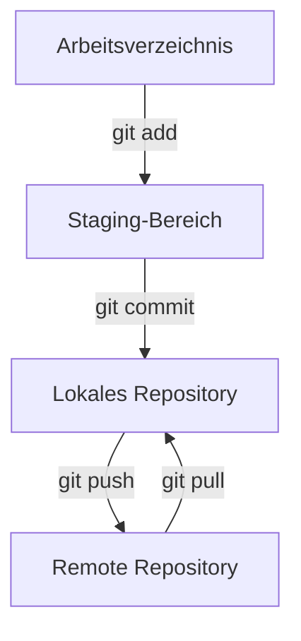

# Einführung in Git

Git ist ein leistungsfähiges Versionskontrollsystem, das dir hilft, Änderungen an deinen Projekten nachzuverfolgen, Fehler rückgängig zu machen und effektiv mit anderen zusammenzuarbeiten.

## Inhaltsverzeichnis
1. [Grundlagen](#1-grundlagen)
2. [Lokale Git-Arbeit](#2-lokale-git-arbeit)
3. [Remote-Repositories (GitHub)](#3-remote-repositories-github)
4. [Erweiterte Konzepte](#4-erweiterte-konzepte)
5. [Praktische Workflows](#5-praktische-workflows)
6. [Ressourcen und Tools](#6-ressourcen-und-tools)

---

## 1. Grundlagen

### 1.1 Voraussetzungen

**Git Installation erforderlich!**
- **Download:** [git-scm.com](https://git-scm.com/downloads)
- **Installation:** Standardeinstellungen verwenden
- **Überprüfung:** `git --version` im Terminal eingeben

Detaillierte Anleitung: [Visual Studio Code Installation](visual_studio_code_install.md)

### 1.2 Was ist Git?

**Git ist ein Versionskontrollsystem mit drei Hauptfunktionen:**
- 🔄 **Versionskontrolle:** Speichert verschiedene Versionen deiner Dateien
- 👥 **Zusammenarbeit:** Mehrere Personen können parallel arbeiten
- 📝 **Nachvollziehbarkeit:** Alle Änderungen werden dokumentiert

### 1.3 Git-Workflow verstehen



**Die drei Bereiche:**
- **Arbeitsverzeichnis:** Deine aktuellen Dateien
- **Staging-Bereich:** Vorgemerkten Änderungen
- **Repository:** Gespeicherte Versionen (Commits)

---

## 2. Lokale Git-Arbeit

### 2.1 Repository erstellen

```bash
git init
```
Erstellt ein neues Git-Repository im aktuellen Ordner.

### 2.2 Grundlegende Befehle

#### Status prüfen
```bash
git status
```
Zeigt den aktuellen Stand der Dateien.

#### Dateien hinzufügen (Staging)
```bash
git add dateiname.txt    # Einzelne Datei
git add .                # Alle Änderungen
```

#### Änderungen speichern (Commit)
```bash
git commit -m "Aussagekräftige Beschreibung"
```

#### Änderungen vergleichen
```bash
git diff                 # Unterschiede zu letztem Commit
git log                  # Historie der Commits anzeigen
```

### 2.3 Wichtige lokale Befehle im Überblick

| Befehl | Beschreibung |
|--------|-------------|
| `git status` | Zeigt Status der Dateien |
| `git add .` | Alle Änderungen stagen |
| `git commit -m "text"` | Änderungen speichern |
| `git log` | Commit-Historie anzeigen |
| `git diff` | Änderungen vergleichen |

---

## 3. Remote-Repositories (GitHub)

### 3.1 Repository mit GitHub verbinden

```bash
# Remote-Verbindung hinzufügen
git remote add origin https://github.com/USERNAME/REPOSITORY.git

# Ersten Push mit Branch-Verknüpfung
git push -u origin main
```

**Erklärung der Befehle:**
- `git remote add origin URL` → Fügt eine Verbindung namens "origin" zu GitHub hinzu
- `origin` → Standard-Name für das Haupt-Remote-Repository
- `-u` → Verknüpft den lokalen "main"-Branch mit dem Remote-"main"-Branch
- Nach dem ersten `git push -u origin main` reicht in Zukunft nur noch `git push`


### 3.2 Mit Remote-Repository arbeiten

#### Änderungen hochladen (Push)
```bash
git push                    # Alle Commits zum Remote-Repository senden
git push origin main        # Explizit zum main-Branch auf origin pushen
git push origin feature     # Bestimmten Branch pushen
```

#### Änderungen herunterladen (Pull)
```bash
git pull                    # Neueste Änderungen holen und automatisch mergen
git pull origin main        # Explizit vom main-Branch auf origin pullen
```

**Was passiert bei `git pull`?**
1. **Fetch:** Lädt neue Commits vom Remote-Repository
2. **Merge:** Integriert diese automatisch in deinen aktuellen Branch

#### Repository klonen
```bash
git clone https://github.com/USERNAME/REPOSITORY.git
```
**Was passiert beim Klonen?**
- Lädt das komplette Repository herunter
- Erstellt lokalen Ordner mit dem Repository-Namen  
- Richtet automatisch `origin` Remote-Verbindung ein
- Wechselt in den Hauptbranch (meist `main` oder `master`)

### 3.3 Remote-Verbindungen verwalten

#### Remote-Verbindungen anzeigen
```bash
git remote -v               # Zeigt alle Remote-Verbindungen mit URLs
```

#### Remote hinzufügen/ändern/entfernen
```bash
git remote add upstream https://github.com/ORIGINAL/REPO.git    # Zweites Remote hinzufügen
git remote set-url origin https://new-url.git                   # URL ändern
git remote remove upstream                                      # Remote entfernen
```

---

## 4. Erweiterte Konzepte

### 4.1 Branches (Verzweigungen)

Branches ermöglichen parallele Entwicklung ohne Störung des Hauptcodes.

#### Branch erstellen und wechseln
```bash
git checkout -b feature-name    # Erstellen und wechseln
git branch                      # Alle Branches anzeigen
git checkout main               # Zu anderem Branch wechseln
```

#### Nützliche Branch-Befehle
| Befehl | Beschreibung |
|--------|-------------|
| `git branch -a` | Alle Branches anzeigen |
| `git branch -d name` | Branch löschen |
| `git checkout -` | Zum vorherigen Branch |

### 4.2 Merging (Zusammenführung)

```bash
git checkout main               # Zum Zielbranch wechseln
git merge feature-name          # Branch zusammenführen
git branch -d feature-name      # Feature-Branch löschen
```

### 4.3 Merge Conflicts lösen

#### Wie sieht ein Conflict aus?
```text
Normal text here...

<<<<<<< HEAD
Inhalt vom aktuellen Branch (main)
=======
Inhalt vom anderen Branch (feature)
>>>>>>> feature-name

More normal text...
```

#### Conflict-Lösung in VS Code
1. **Konfliktdatei öffnen** → VS Code zeigt Conflicts farblich an
2. **Option wählen:**
   - "Accept Current Change" → Aktuelle Version
   - "Accept Incoming Change" → Eingehende Version  
   - "Accept Both Changes" → Beide Versionen
   - Manuell bearbeiten
3. **Konfliktmarker entfernen** (`<<<<<<<`, `=======`, `>>>>>>>`)
4. **Speichern und committen:**
   ```bash
   git add .
   git commit -m "Merge conflict resolved"
   ```

### 4.4 Pull Requests

Pull Requests ermöglichen **Code Review** vor dem Merge.

#### Pull Request erstellen:
1. **Branch pushen:** `git push origin feature-name`
2. **Auf GitHub** → "Compare & pull request"
3. **Titel und Beschreibung** eingeben
4. **Reviewer hinzufügen** (optional)
5. **"Create pull request"**

#### Review-Prozess:
- Code wird von Reviewern geprüft
- Diskussion über Änderungen
- Weitere Commits möglich
- Merge nach Freigabe

---

## 5. Praktische Workflows

### 5.1 Einfacher Workflow (Solo-Entwicklung)
```bash
# 1. Änderungen machen
# 2. Status prüfen
git status
# 3. Änderungen stagen
git add .
# 4. Commit erstellen
git commit -m "Feature XY implementiert"
# 5. Zu GitHub pushen
git push
```

### 5.2 Branch-Workflow (Team-Entwicklung)
```bash
# 1. Feature-Branch erstellen
git checkout -b new-feature
# 2. Entwicklung und Commits
git add . && git commit -m "Feature implementiert"
# 3. Branch pushen
git push origin new-feature
# 4. Pull Request auf GitHub erstellen
# 5. Nach Review: Merge durchführen
# 6. Aufräumen
git checkout main
git pull
git branch -d new-feature
```

### 5.3 Conflict-Resolution-Workflow
```bash
# 1. Merge versuchen
git merge feature-branch
# 2. Bei Conflicts: Dateien in VS Code öffnen
# 3. Conflicts lösen (Accept Current/Incoming/Both/Manual)
# 4. Speichern und abschließen
git add .
git commit -m "Merge conflict resolved"
```

---

## 6. Ressourcen und Tools

### 6.1 Grafische Tools

**GitHub Desktop** (Empfohlen für Einsteiger)
- Download: [desktop.github.com](https://desktop.github.com/)
- Vereinfacht Git-Befehle durch grafische Oberfläche

**VS Code Extensions:**
- "GitHub Pull Requests and Issues"
- "GitLens"

### 6.2 Weiterführende Ressourcen

- [Git Dokumentation](https://git-scm.com/doc)
- [GitHub Guides](https://guides.github.com/)
- [Git Cheat Sheet (deutsch)](https://education.github.com/git-cheat-sheet-education.pdf)

### 6.3 Wichtige Befehle - Übersicht

| Kategorie | Befehl | Beschreibung |
|-----------|--------|-------------|
| **Basis** | `git status` | Status anzeigen |
| | `git add .` | Alle Änderungen stagen |
| | `git commit -m ""` | Commit erstellen |
| **Remote** | `git push` | Zu GitHub hochladen |
| | `git pull` | Von GitHub herunterladen |
| | `git clone URL` | Repository klonen |
| **Branches** | `git checkout -b name` | Branch erstellen + wechseln |
| | `git merge name` | Branch zusammenführen |
| | `git branch -d name` | Branch löschen |

---

## 🎯 Nächste Schritte

1. **Git installieren** und `git --version` testen
2. **Erstes Repository** mit `git init` erstellen
3. **Erste Commits** mit Add → Commit → Push
4. **GitHub Account** erstellen und Repository verbinden
5. **Branches ausprobieren** für neue Features

**Du bist jetzt bereit für professionelle Versionskontrolle mit Git! 🚀**
