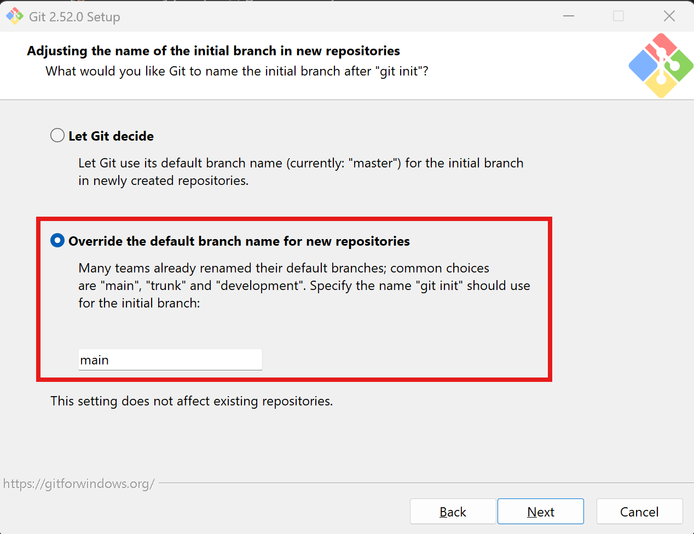

# Anleitung: Installation von Visual Studio Code, Git, PlatformIO, und Wokwi

**Wichtiger Hinweis:** In der Schule können die ersten drei Tools (Visual Studio Code, Git und Github Desktop) direkt über das Software Center installiert werden und sind möglicherweise schon installiert.

## Visual Studio Code installieren

1. Öffne deinen Webbrowser und gehe auf [https://code.visualstudio.com/](https://code.visualstudio.com/).
2. Klicke auf **Download for Windows** (oder wähle dein Betriebssystem).
3. Starte die heruntergeladene Installationsdatei und folge den Anweisungen.  
4. Nach der Installation öffne Visual Studio Code.

## GitHub Account erstellen

1. Gehe auf [github.com](https://github.com).
2. Klicke auf "Sign up" und folge den Anweisungen.
3. Bestätige deine E-Mail-Adresse.

## Git und GitHub einrichten

1. Installiere [Git für Windows](https://git-scm.com/download/win) (oder für dein Betriebssystem).
2. Starte die Installationsdatei und folge den Anweisungen.
3. im 5. Schritt -> wähle Visual Studio Code als "Default editor"
4. Im 6. Schritt wähle "Overwrite the default branch name for new repositories" and set the branch name to main

Ev. neustarten von VSC?

Oder: 
3. Öffne Visual Studio Code.
4. Klicke auf das **Erweiterungen-Symbol** (Quadrat mit vier kleinen Quadraten).
5. Suche nach **GitHub Pull Requests and Issues**.
6. Klicke auf **Installieren** beim GitHub Plugin.
8. Melde dich im GitHub Plugin mit deinem GitHub-Konto an, um Repositorys zu verwalten und Issues zu bearbeiten.

**Hinweis:** Nach der Installation kannst du direkt aus Visual Studio Code mit Git und GitHub arbeiten.

**Tipp:** Überprüfe die erfolgreiche Installation, indem du im Terminal (Eingabeaufforderung) den Befehl `git --version` eingibst. Möglicherweise ist ein Neustart deines Computers notwendig.

## GitHub Desktop installieren

1. Öffne deinen Webbrowser und gehe auf [https://desktop.github.com/](https://desktop.github.com/).
2. Klicke auf **Download for Windows** (oder wähle dein Betriebssystem).
3. Starte die heruntergeladene Installationsdatei und folge den Anweisungen.
4. Nach der Installation öffne **GitHub Desktop**.
5. Melde dich mit deinem GitHub-Konto an, um deine Repositorys zu verwalten.

**Tipp:** Mit GitHub Desktop kannst du Änderungen an Projekten einfach lokal verwalten und mit GitHub synchronisieren.

## PlatformIO IDE Plugin installieren

1. Öffne Visual Studio Code.
2. Klicke links auf das **Erweiterungen-Symbol** (Quadrat mit vier kleinen Quadraten).
3. Suche nach **PlatformIO IDE**.
4. Klicke auf **Installieren** beim PlatformIO IDE Plugin.
5. Nach der Installation erscheint ein neues PlatformIO-Symbol in der linken Seitenleiste.

## Wokwi Simulator Plugin installieren

1. Gehe erneut zum **Erweiterungen-Symbol** in Visual Studio Code.
2. Suche nach **Wokwi Simulator**.
3. Klicke auf **Installieren** beim Wokwi Plugin.
4. Nach der Installation kannst du Wokwi direkt in Visual Studio Code verwenden.

**Tipp:** Starte Visual Studio Code nach der Installation der Plugins neu, um alle Funktionen nutzen zu können.

### Wokwi Lizenz manuell hinterlegen

1. Besuche die [Wokwi Lizenz-Seite](https://wokwi.com/license) und melde dich mit deinem Wokwi-Konto an.
   Falls du noch kein Wokwi-Konto hast, erstelle zunächst ein neues Konto auf der Wokwi Lizenz-Seite.
2. Erstelle eine **gratis** 30-Tage Lizenz und kopiere den Lizenzschlüssel aus deinem Wokwi-Konto.
3. Falls Visual Studio Code deinen Lizenzschlüssel nicht automatisch erkennt, drücke **F1** in Visual Studio Code. Gib anschließend **Wokwi: Manually Enter License Key** ein und füge den Lizenzschlüssel ein.
4. Starte Visual Studio Code neu, damit die Lizenz aktiviert wird.

**Hinweis:** Die Lizenz ermöglicht erweiterte Funktionen und die Nutzung von Wokwi ohne Einschränkungen. Die Gratis-Lizenz muss alle 30 Tage erneuert werden.
