# Flussdiagramm Basics - Grundlagen

Flussdiagramme (auch Programmablaufpläne oder PAP genannt) sind eine grafische Darstellung von Programmabläufen. Sie helfen dabei, die Logik eines Programms zu verstehen und zu planen, bevor der eigentliche Code geschrieben wird.

## Inhaltsverzeichnis
- [Grundlegende Elemente](#grundlegende-elemente)
- [EVA-Prinzip (Eingabe-Verarbeitung-Ausgabe)](#eva-prinzip-eingabe-verarbeitung-ausgabe)
- [Verzweigungen (If-Then-Else)](#verzweigungen-if-then-else)
- [Schleifen](#schleifen)
- [Beispiele zum Üben](#beispiele-zum-üben)

---

## Grundlegende Elemente

Für die meisten Programme benötigst du nur vier verschiedene Grundelemente:

### 🟢 Start/Ende (Oval)
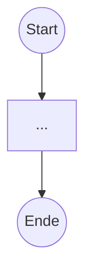
- **Start:** Zeigt den Beginn des Programms
- **Ende:** Zeigt das Ende des Programms
- **Form:** Oval oder abgerundetes Rechteck

### 📦 Aktion/Prozess (Rechteck)
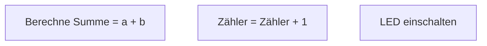
- **Verwendung:** Berechnungen, Zuweisungen, Aktionen
- **Form:** Rechteck
- **Beispiele:** 
  - `Zähler = 0`
  - `Summe = a + b`
  - `LED einschalten`

**Hinweis:** Eine Aktion oder ein Prozess hat immer ein Verb als Beschreibung mit dabei. z.B. Timer *starten*

### 📋 Ein-/Ausgabe (Rechteck oder Parallelogramm)
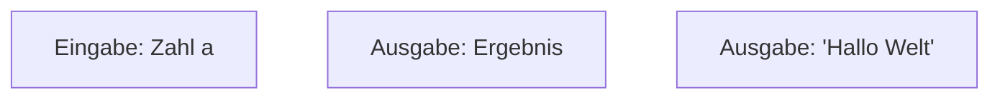
- **Verwendung:** Daten einlesen oder ausgeben
- **Form:** Rechteck (vereinfacht)
- **Beispiele:**
  - `Eingabe: Name`
  - `Ausgabe: Ergebnis`
  - `Ausgabe: 'Fehler!'`

### 💎 Verzweigung/Entscheidung (Raute)
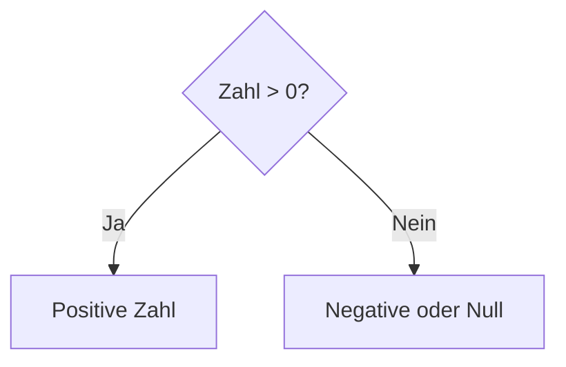
- **Verwendung:** Ja/Nein-Entscheidungen, Bedingungen prüfen
- **Form:** Raute (Diamant)
- **Ausgänge:** Meist "Ja" und "Nein" oder "Wahr" und "Falsch"

---

## EVA-Prinzip (Eingabe-Verarbeitung-Ausgabe)

Das **EVA-Prinzip** ist das Grundmuster der meisten Programme:
1. **E**ingabe: Daten werden eingelesen
2. **V**erarbeitung: Daten werden bearbeitet/berechnet
3. **A**usgabe: Ergebnis wird ausgegeben

### Beispiel 1: Einfache Addition
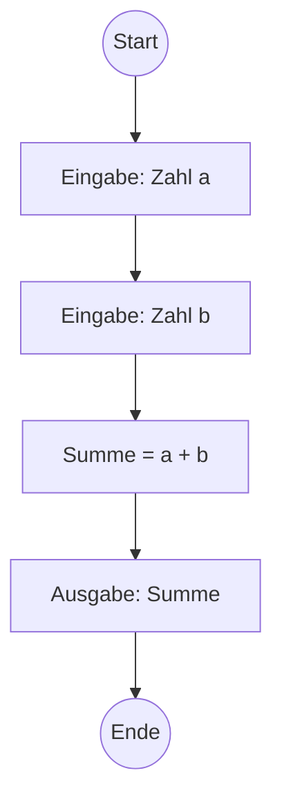

**Erklärung:**
- **Eingabe:** Zwei Zahlen werden eingelesen
- **Verarbeitung:** Die Zahlen werden addiert
- **Ausgabe:** Das Ergebnis wird angezeigt

### Beispiel 2: Kreisumfang berechnen
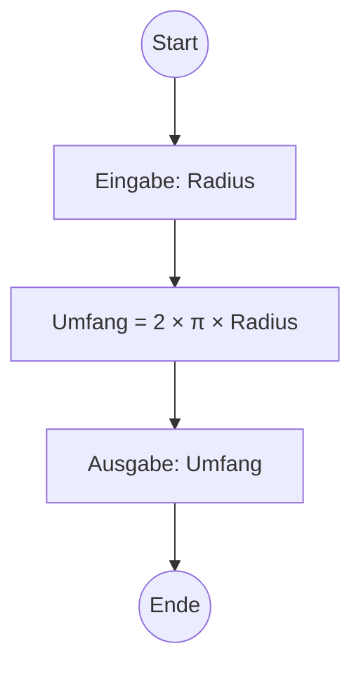

**Erklärung:**
- **E:** Radius eingeben
- **V:** Umfang mit Formel berechnen
- **A:** Ergebnis ausgeben

---

## Verzweigungen (If-Then-Else)

Verzweigungen ermöglichen es, verschiedene Programmwege je nach Bedingung zu durchlaufen.

### Beispiel 1: Einfache Verzweigung
**Aufgabe:** Prüfe, ob eine Zahl positiv oder negativ ist.

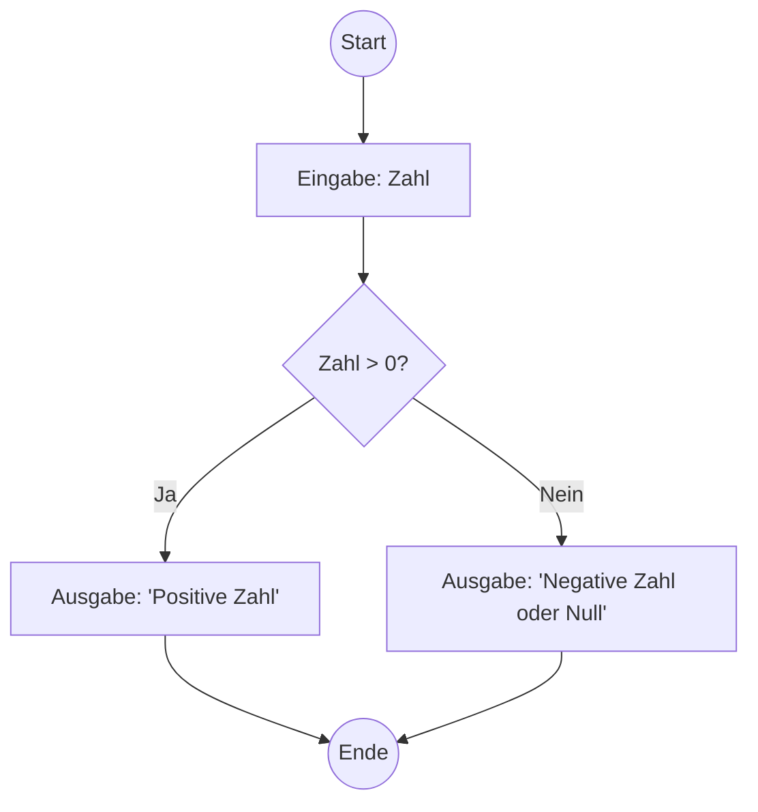

### Beispiel 2: Mehrfache Verzweigung
**Aufgabe:** Notenbewertung (1-5)

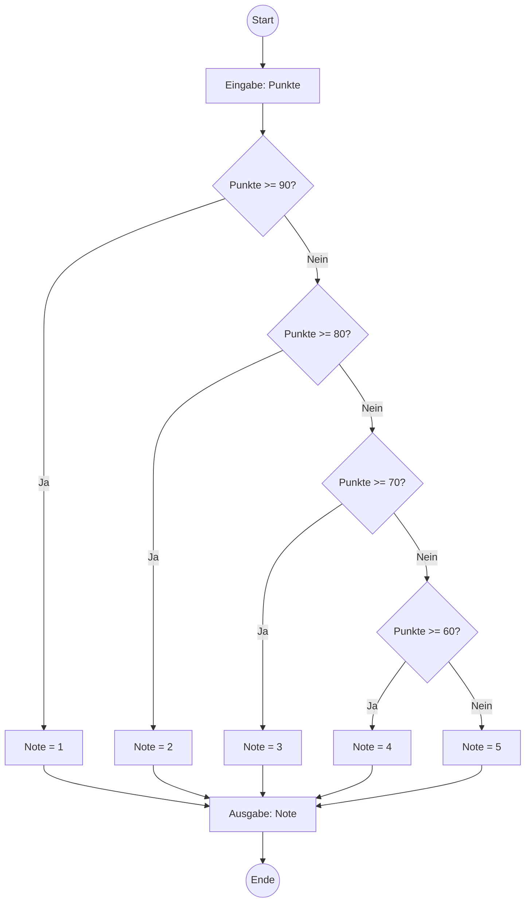

### Beispiel 3: Ampel-Steuerung
**Aufgabe:** Ampelfarbe bestimmen

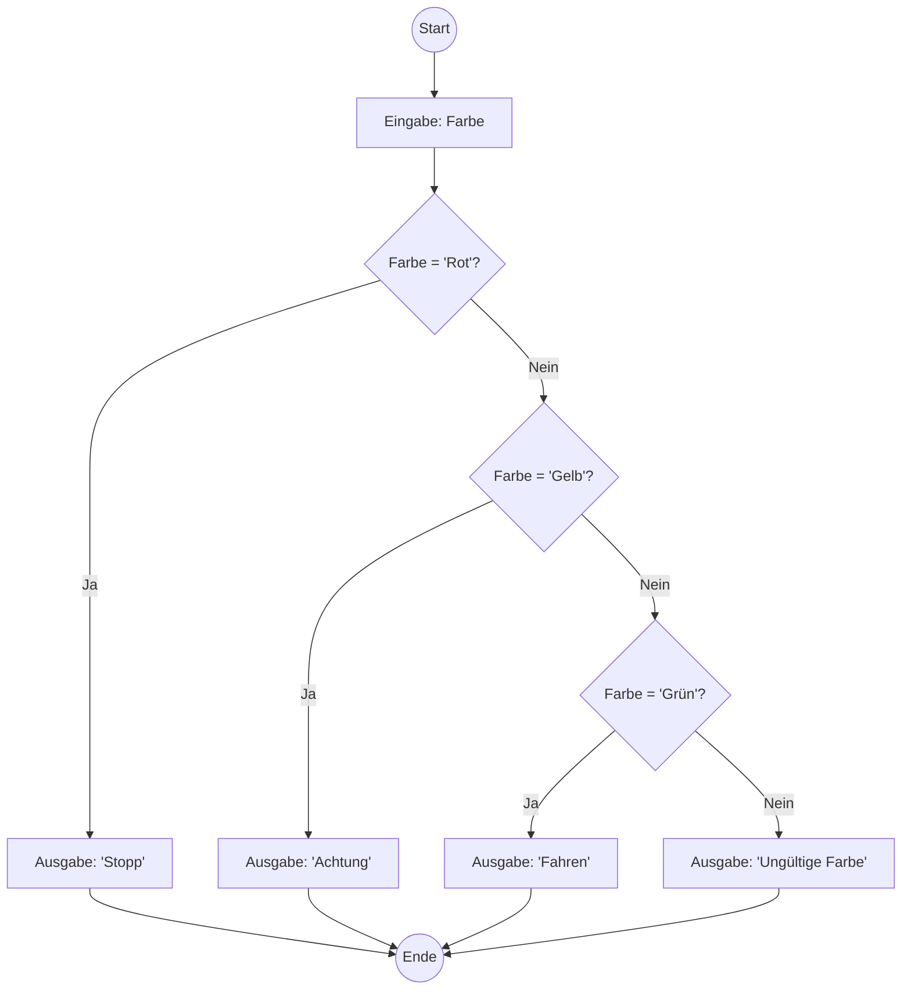

---

## Schleifen

Schleifen ermöglichen es, bestimmte Programmteile mehrfach auszuführen.

### Beispiel 1: Zählschleife (von 1 bis 5)
**Aufgabe:** Gib die Zahlen von 1 bis 5 aus.

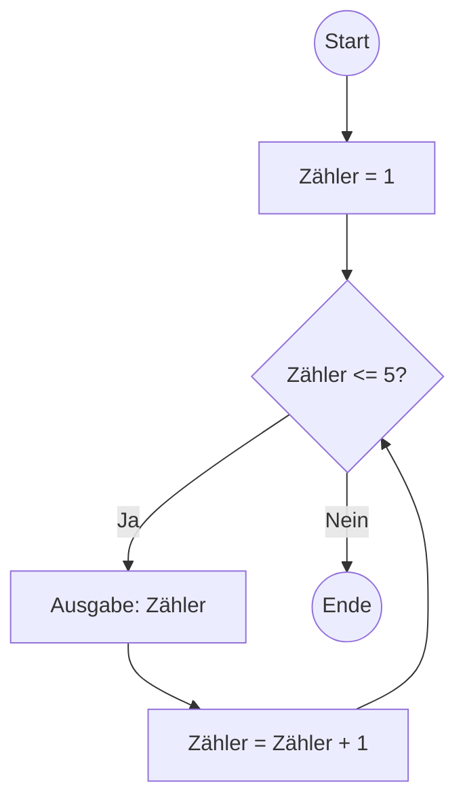

**Ablauf:**
1. Zähler startet bei 1
2. Prüfe: Ist Zähler ≤ 5?
3. Wenn ja: Zähler ausgeben, um 1 erhöhen, zurück zu Schritt 2
4. Wenn nein: Schleife beenden

### Beispiel 2: Benutzer-gesteuerte Schleife
**Aufgabe:** Zahlen eingeben, bis 0 eingegeben wird.

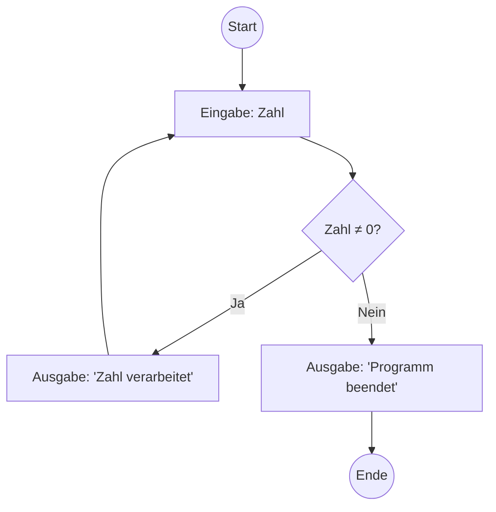

### Beispiel 3: Summe berechnen (1+2+3+...+n)
**Aufgabe:** Berechne die Summe aller Zahlen von 1 bis n.

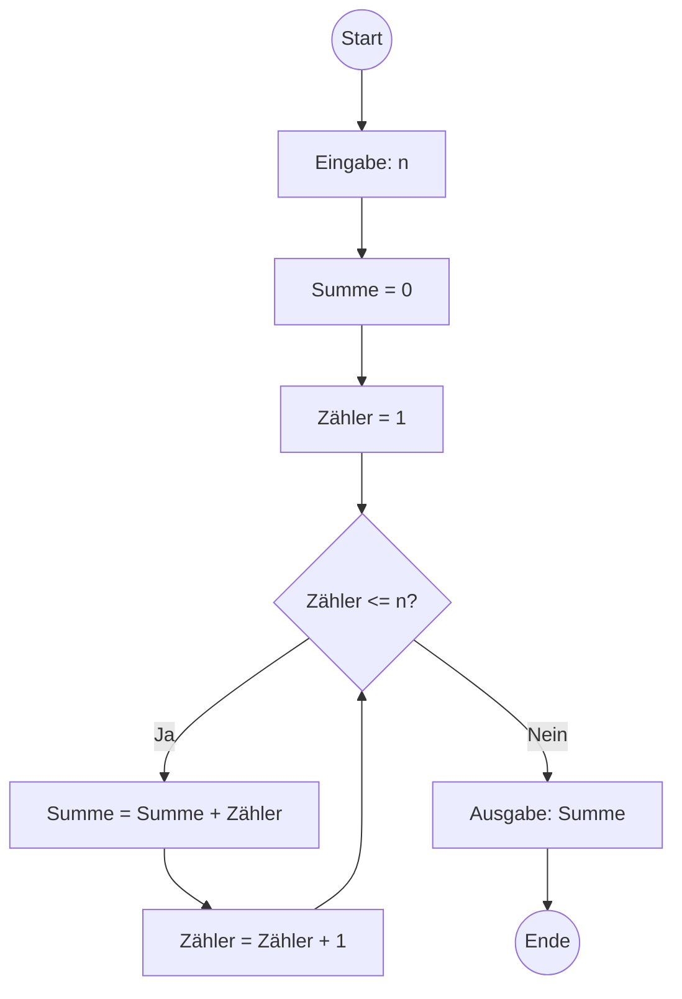

### Beispiel 4: LED-Blinken (Arduino)
**Aufgabe:** LED 10 mal blinken lassen.

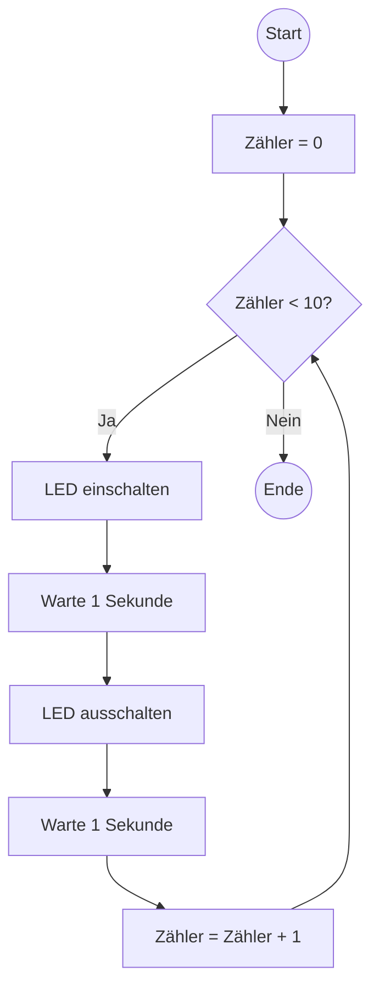

---

## Beispiele zum Üben

### Übung 1: Gerade oder ungerade?
**Aufgabe:** Prüfe, ob eine eingegebene Zahl gerade oder ungerade ist.
**Hinweis:** Eine Zahl ist gerade, wenn sie durch 2 teilbar ist (Rest = 0).

Lösung anzeigen

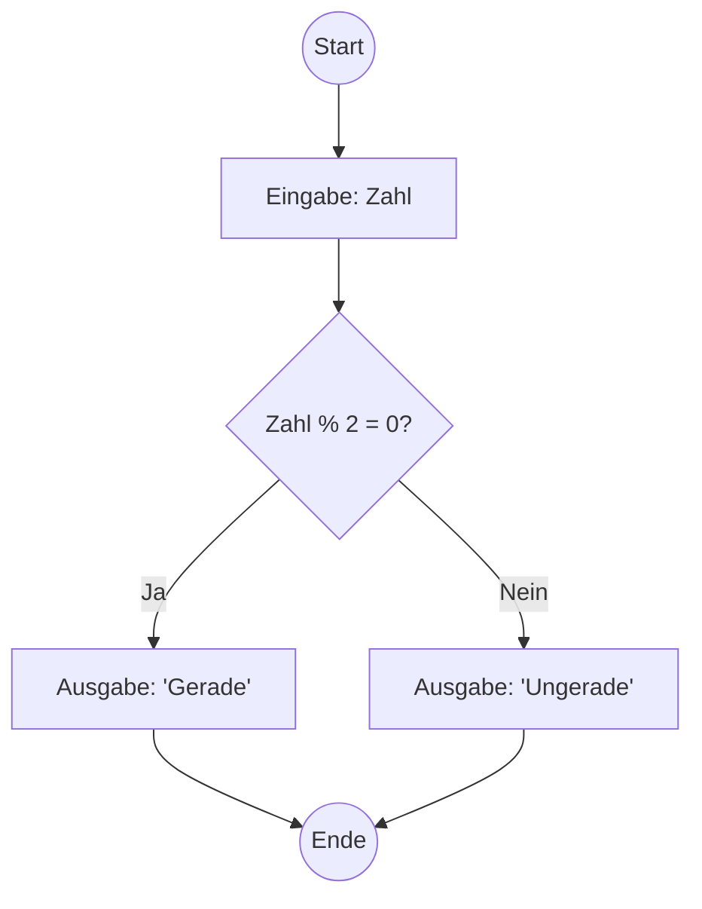

### Übung 2: Maximum von drei Zahlen
**Aufgabe:** Finde die größte von drei eingegebenen Zahlen.

Lösung anzeigen

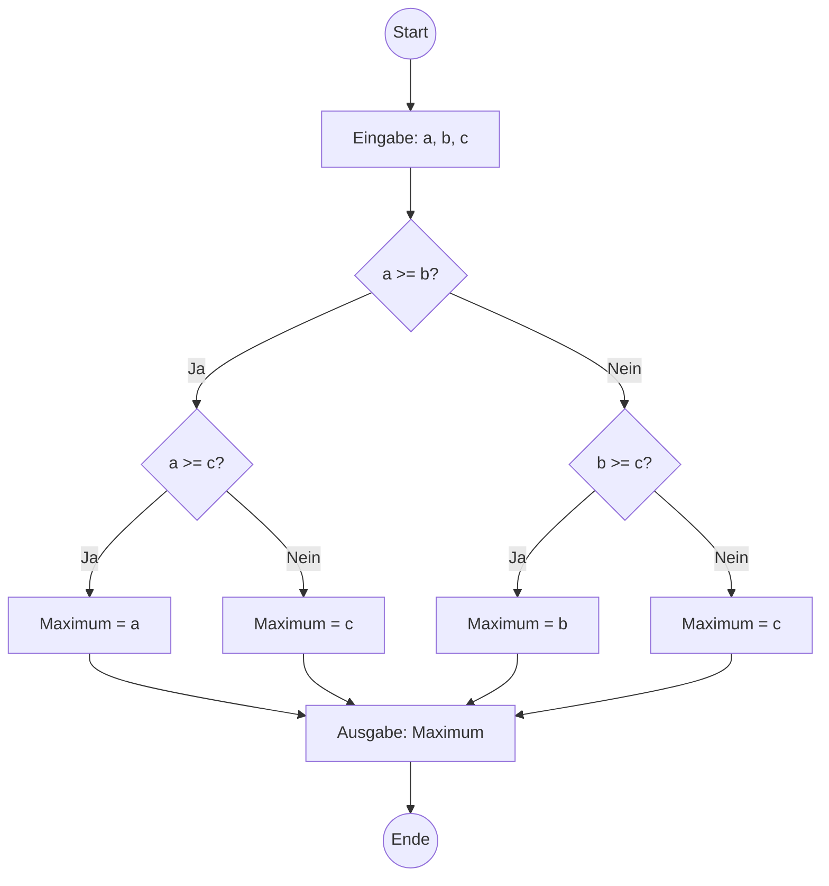

### Übung 3: Fakultät berechnen
**Aufgabe:** Berechne n! = 1 × 2 × 3 × ... × n

Lösung anzeigen

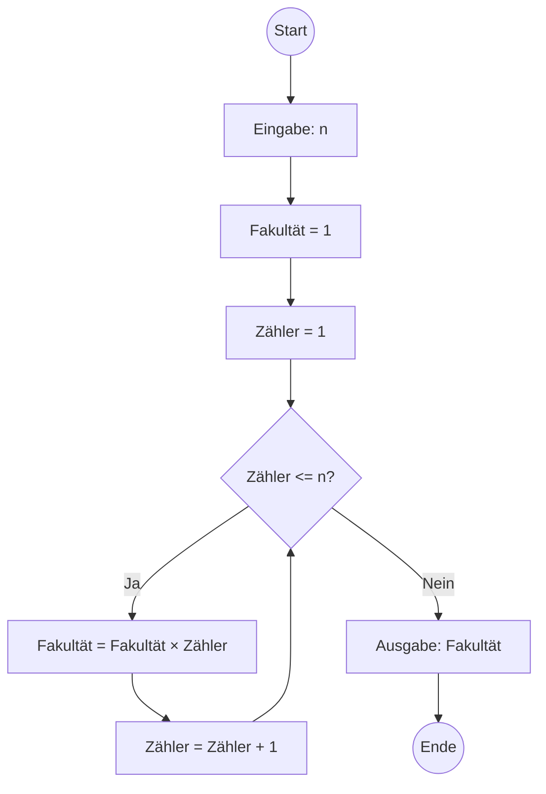

---

## 🎯 Wichtige Tipps

### Beim Erstellen von Flussdiagrammen:
1. **Beginne immer mit "Start"** und ende mit "Ende"
2. **Verwende klare, eindeutige Beschriftungen** in den Elementen
3. **Pfeile zeigen die Richtung** des Programmflusses
4. **Jede Raute braucht mindestens zwei Ausgänge** (Ja/Nein)
5. **Vermeide sich kreuzende Linien** - das macht das Diagramm unübersichtlich

### Häufige Fehler vermeiden:
- ❌ Vergessene Start/Ende-Elemente
- ❌ Rauten ohne klare Ja/Nein-Ausgänge
- ❌ Endlosschleifen (kein Ausstieg aus der Schleife)
- ❌ Unklare Beschriftungen wie "Mache etwas"

### Testmethode:
**"Trockenlauf"** - Gehe das Flussdiagramm mit Beispieldaten durch:
1. Wähle konkrete Testwerte
2. Folge Schritt für Schritt dem Diagramm
3. Notiere alle Zwischenergebnisse
4. Prüfe, ob das erwartete Ergebnis herauskommt

---

## 🚀 Nächste Schritte

Wenn du diese Grundlagen verstanden hast, kannst du mit den [ersten Übungen](erste_uebungen.md) beginnen!

**Übungsreihenfolge:**
1. **EVA-Programme** (einfache Ein-/Ausgabe mit Berechnung)
2. **Einfache Verzweigungen** (if-then-else)
3. **Schleifen** (for/while)
4. **Kombinierte Programme** (Verzweigungen + Schleifen)

Viel Erfolg beim Programmieren! 💻