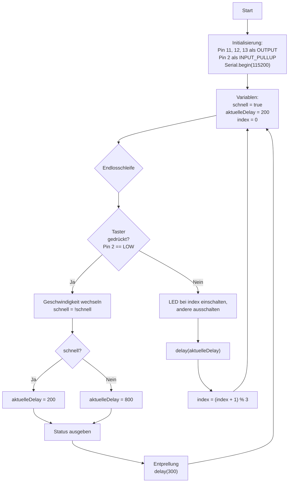

# Übungsbeispiel 2a: LED-Lauflicht mit Geschwindigkeits-Taster - Lösung

## Flussdiagramm

- Initialisierung (Pins, Serial, Variablen) - optional
- Hauptschleife mit:
  - Taster-Abfrage
  - LED-Umschaltung vorwärts
  - Geschwindigkeit anwenden
  - Status-Ausgabe bei Änderung



---

## Lösung

```cpp
// Pin-Definitionen
const int LED1_PIN = 11;
const int LED2_PIN = 12;
const int LED3_PIN = 13;
const int BUTTON_PIN = 2;   // Geschwindigkeit

// LED-Array
const int LEDS[3] = {LED1_PIN, LED2_PIN, LED3_PIN};

// Zustandsvariablen
bool schnellModus = true;
int aktuelleDelay = 200;
int indexAktuell = 0; // 0=LED1, 1=LED2, 2=LED3

// Entprellung
int lastButton = HIGH;

void setup() {
  pinMode(LED1_PIN, OUTPUT);
  pinMode(LED2_PIN, OUTPUT);
  pinMode(LED3_PIN, OUTPUT);
  pinMode(BUTTON_PIN, INPUT_PULLUP);

  Serial.begin(115200);
  Serial.println("LED-Lauflicht (3 LEDs) mit Geschwindigkeits-Taster");
  Serial.println("Taster: Geschwindigkeit umschalten (schnell/ langsam)");
  zeigeStatus();
}

void loop() {
  // Taster abfragen (Geschwindigkeit)
  int buttonState = digitalRead(BUTTON_PIN);
  if (buttonState == LOW && lastButton == HIGH) {
    schnellModus = !schnellModus;
    aktuelleDelay = schnellModus ? 200 : 800;
    zeigeStatus();
    delay(300); // einfache Entprellung
  }
  lastButton = buttonState;

  // Lauflicht vorwärts über 3 LEDs
  digitalWrite(LED1_PIN, LOW);
  digitalWrite(LED2_PIN, LOW);
  digitalWrite(LED3_PIN, LOW);

  digitalWrite(LEDS[indexAktuell], HIGH);
  delay(aktuelleDelay);

  indexAktuell = (indexAktuell + 1) % 3; // 0->1->2->0
}

void zeigeStatus() {
  Serial.println("--- Aktueller Status ---");
  Serial.print("Geschwindigkeit: ");
  Serial.print(schnellModus ? "Schnell" : "Langsam");
  Serial.print(" (");
  Serial.print(aktuelleDelay);
  Serial.println("ms)");
}
```

---

## Erklärung

- Ein Taster (Pull-Up) schaltet zwischen 200ms und 800ms pro Schritt
- Lauflicht läuft fest vorwärts über 3 LEDs
- Status wird bei jeder Umschaltung seriell ausgegeben
- Einfache Entprellung per `delay(300)`
