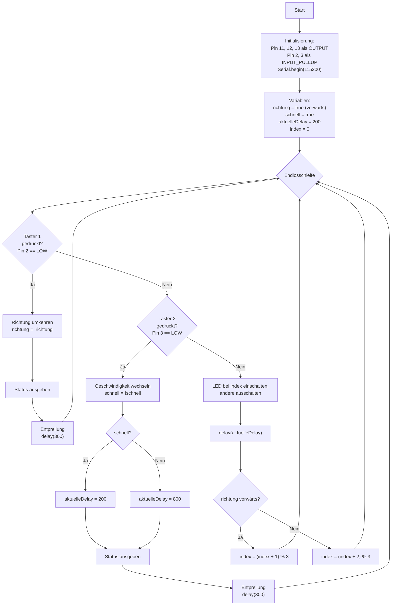

# Übungsbeispiel 2b: LED-Lauflicht mit Taster-Steuerung - Lösung

## Flussdiagramm

- Initialisierung (Pins, Serial, Variablen) - optional
- Hauptschleife mit:
  - Taster-Abfrage (beide Taster)
  - Lauflicht-Steuerung über drei LEDs
  - LED-Umschaltung mit Richtungslogik
  - Status-Ausgabe
  


---

## Lösung

```cpp
// Pin-Definitionen
const int LED1_PIN = 11;
const int LED2_PIN = 12;
const int LED3_PIN = 13;
const int BUTTON1_PIN = 2;  // Richtung
const int BUTTON2_PIN = 3;  // Geschwindigkeit

// LED-Array für einfaches Umschalten
const int LEDS[3] = {LED1_PIN, LED2_PIN, LED3_PIN};

// Zustandsvariablen
bool richtungVorwaerts = true;
bool schnellModus = true;
int aktuelleDelay = 200;
int indexAktuell = 0; // 0=LED1, 1=LED2, 2=LED3

// Für Taster-Entprellung
int lastButton1 = HIGH;
int lastButton2 = HIGH;

void setup() {
  // Pin-Konfiguration
  pinMode(LED1_PIN, OUTPUT);
  pinMode(LED2_PIN, OUTPUT);
  pinMode(LED3_PIN, OUTPUT);
  pinMode(BUTTON1_PIN, INPUT_PULLUP);
  pinMode(BUTTON2_PIN, INPUT_PULLUP);
  
  // Serielle Kommunikation starten
  Serial.begin(115200);
  
  // Willkommensnachricht
  Serial.println("LED-Lauflicht mit Taster-Steuerung (3 LEDs)");
  Serial.println("-------------------------------------------");
  Serial.println("Taster 1: Richtung umkehren");
  Serial.println("Taster 2: Geschwindigkeit wechseln");
  Serial.println();
  zeigeStatus();
}

void loop() {
  // Taster 1 abfragen (Richtung)
  int button1State = digitalRead(BUTTON1_PIN);
  if (button1State == LOW && lastButton1 == HIGH) {
    richtungVorwaerts = !richtungVorwaerts;
    zeigeStatus();
    delay(300);  // Entprellung
  }
  lastButton1 = button1State;
  
  // Taster 2 abfragen (Geschwindigkeit)
  int button2State = digitalRead(BUTTON2_PIN);
  if (button2State == LOW && lastButton2 == HIGH) {
    schnellModus = !schnellModus;
    
    // Delay anpassen
    aktuelleDelay = schnellModus ? 200 : 800;
    
    zeigeStatus();
    delay(300);  // Entprellung
  }
  lastButton2 = button2State;
  
  // Lauflicht über 3 LEDs ausführen
  // Alle LEDs ausschalten
  digitalWrite(LED1_PIN, LOW);
  digitalWrite(LED2_PIN, LOW);
  digitalWrite(LED3_PIN, LOW);
  
  // Aktuelle LED einschalten
  digitalWrite(LEDS[indexAktuell], HIGH);
  
  // Wartezeit entsprechend Modus
  delay(aktuelleDelay);
  
  // Index je nach Richtung anpassen
  if (richtungVorwaerts) {
    indexAktuell = (indexAktuell + 1) % 3; // 0->1->2->0
  } else {
    indexAktuell = (indexAktuell + 2) % 3; // 0->2->1->0  (entspricht -1 modulo 3)
  }
}

void zeigeStatus() {
  Serial.println("--- Aktueller Status ---");
  Serial.print("Richtung: ");
  Serial.println(richtungVorwaerts ? "Vorwärts (LED1→LED2→LED3)" : "Rückwärts (LED3→LED2→LED1)");
  Serial.print("Geschwindigkeit: ");
  Serial.print(schnellModus ? "Schnell" : "Langsam");
  Serial.print(" (");
  Serial.print(aktuelleDelay);
  Serial.println("ms)");
  Serial.println();
}
```

---

## Erklärung

Siehe Flussdiagramm und Kommentare im Code:
- Drei LEDs im Rundlauf, Richtung mit Taster 1 umkehrbar
- Geschwindigkeit (200ms/800ms) mit Taster 2 umschaltbar
- Serielle Statusausgaben bei jeder Änderung
- Einfache Entprellung mit `delay(300)`
