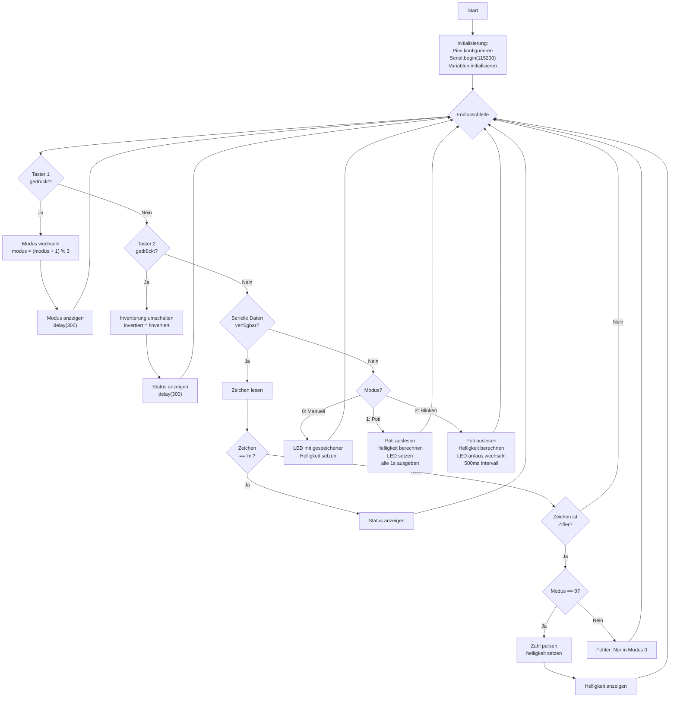

# Übungsbeispiel 5: Komplexe LED-Steuerung mit mehreren Eingabequellen - Lösung

## Flussdiagramm

- Initialisierung (Pins, Serial, Variablen) -optional
- Hauptschleife mit:
  - Taster-Abfragen (beide)
  - Serielle Eingabe prüfen
  - Modi-spezifische Logik
  - LED-Steuerung
  - Status-Ausgaben
  


---

## Lösung

```cpp
// Pin-Definitionen
const int LED_PIN = 9;
const int POTI_PIN = A0;
const int BUTTON1_PIN = 2;  // Modus wechseln
const int BUTTON2_PIN = 3;  // Invertierung

// Zustandsvariablen
int modus = 1;              // 0=Manuell, 1=Poti, 2=Blinken
int helligkeit = 128;       // Aktuelle Helligkeit
bool invertiert = false;    // Invertierung aktiv?
bool ledZustand = false;    // Für Blinkmodus

// Taster-Status
int lastButton1 = HIGH;
int lastButton2 = HIGH;

// Timing
unsigned long letzteAusgabe = 0;
unsigned long letztesBlinken = 0;

void setup() {
  // Pin-Konfiguration
  pinMode(LED_PIN, OUTPUT);
  pinMode(BUTTON1_PIN, INPUT_PULLUP);
  pinMode(BUTTON2_PIN, INPUT_PULLUP);
  
  // Serielle Kommunikation starten
  Serial.begin(115200);
  
  // Willkommensnachricht
  Serial.println("====================================");
  Serial.println("Komplexe LED-Steuerung");
  Serial.println("====================================");
  Serial.println("Taster 1: Modus wechseln");
  Serial.println("Taster 2: Invertierung umschalten");
  Serial.println("Seriell: 0-255 = Helligkeit (nur Modus 0)");
  Serial.println("         'm' = Status anzeigen");
  Serial.println();
  zeigeModus();
}

void loop() {
  // Taster 1: Modus wechseln
  int button1State = digitalRead(BUTTON1_PIN);
  if (button1State == LOW && lastButton1 == HIGH) {
    modus = (modus + 1) % 3;  // 0->1->2->0
    zeigeModus();
    delay(300);
  }
  lastButton1 = button1State;
  
  // Taster 2: Invertierung
  int button2State = digitalRead(BUTTON2_PIN);
  if (button2State == LOW && lastButton2 == HIGH) {
    invertiert = !invertiert;
    Serial.print(">>> Invertierung: ");
    Serial.println(invertiert ? "AN" : "AUS");
    delay(300);
  }
  lastButton2 = button2State;
  
  // Serielle Eingabe verarbeiten
  if (Serial.available() > 0) {
    char zeichen = Serial.read();
    
    // Status anzeigen
    if (zeichen == 'm' || zeichen == 'M') {
      zeigeStatus();
    }
    // Helligkeit setzen (nur Modus 0)
    else if (zeichen >= '0' && zeichen <= '9') {
      if (modus == 0) {
        int wert = zeichen - '0';  // Erste Ziffer
        
        // Weitere Ziffern lesen
        delay(10);  // Kurz warten für weitere Zeichen
        while (Serial.available() > 0) {
          char naechstesZeichen = Serial.peek();
          if (naechstesZeichen >= '0' && naechstesZeichen <= '9') {
            Serial.read();
            wert = wert * 10 + (naechstesZeichen - '0');
          } else {
            break;
          }
          delay(5);
        }
        
        // Wert begrenzen und setzen
        if (wert > 255) wert = 255;
        helligkeit = wert;
        
        Serial.print(">>> Helligkeit gesetzt auf: ");
        Serial.println(helligkeit);
      } else {
        Serial.println(">>> FEHLER: Helligkeit kann nur in Modus 0 gesetzt werden!");
      }
    }
  }
  
  // Modi-spezifische Logik
  int aktuelleHelligkeit = helligkeit;
  
  switch (modus) {
    case 0:  // Manuell - helligkeit bleibt wie gesetzt
      break;
      
    case 1:  // Potentiometer
      {
        int potiWert = analogRead(POTI_PIN);
        aktuelleHelligkeit = potiWert / 4;
        
        // Alle 1000ms ausgeben
        unsigned long jetzt = millis();
        if (jetzt - letzteAusgabe >= 1000) {
          Serial.print("Poti: ");
          Serial.print(potiWert);
          Serial.print(" -> Helligkeit: ");
          Serial.println(aktuelleHelligkeit);
          letzteAusgabe = jetzt;
        }
      }
      break;
      
    case 2:  // Blinken mit Poti-Helligkeit
      {
        int potiWert = analogRead(POTI_PIN);
        aktuelleHelligkeit = potiWert / 4;
        
        // Blinken alle 500ms
        unsigned long jetzt = millis();
        if (jetzt - letztesBlinken >= 500) {
          ledZustand = !ledZustand;
          letztesBlinken = jetzt;
        }
        
        // Wenn LED aus sein soll, Helligkeit auf 0
        if (!ledZustand) {
          aktuelleHelligkeit = 0;
        }
      }
      break;
  }
  
  // Invertierung anwenden
  if (invertiert && aktuelleHelligkeit > 0) {
    aktuelleHelligkeit = 255 - aktuelleHelligkeit;
  }
  
  // LED setzen
  analogWrite(LED_PIN, aktuelleHelligkeit);
}

void zeigeModus() {
  Serial.println();
  Serial.println("====== MODUS GEWECHSELT ======");
  Serial.print("Aktueller Modus: ");
  
  switch (modus) {
    case 0:
      Serial.println("0 - MANUELL (Serielle Steuerung)");
      Serial.println("Geben Sie Wert 0-255 ein");
      break;
    case 1:
      Serial.println("1 - POTENTIOMETER");
      Serial.println("LED folgt Poti-Stellung");
      break;
    case 2:
      Serial.println("2 - BLINKEN");
      Serial.println("LED blinkt mit Poti-Helligkeit");
      break;
  }
  Serial.println("==============================");
  Serial.println();
}

void zeigeStatus() {
  Serial.println();
  Serial.println("====== AKTUELLER STATUS ======");
  Serial.print("Modus: ");
  switch (modus) {
    case 0: Serial.println("Manuell"); break;
    case 1: Serial.println("Potentiometer"); break;
    case 2: Serial.println("Blinken"); break;
  }
  
  if (modus == 0) {
    Serial.print("Helligkeit (manuell): ");
    Serial.println(helligkeit);
  } else {
    int potiWert = analogRead(POTI_PIN);
    Serial.print("Poti-Wert: ");
    Serial.print(potiWert);
    Serial.print(" -> Helligkeit: ");
    Serial.println(potiWert / 4);
  }
  
  Serial.print("Invertierung: ");
  Serial.println(invertiert ? "AN" : "AUS");
  Serial.println("==============================");
  Serial.println();
}
```

---

## Erklärung

### Initialisierung (setup):
- Alle Pins konfiguriert (LED, Poti, 2 Taster)
- Serielle Kommunikation gestartet
- Startwerte gesetzt (Modus 1, Helligkeit 128)

### Hauptschleife (loop):

**Taster 1 - Moduswechsel:**
- Zyklischer Wechsel: 0 → 1 → 2 → 0
- Modulo-Operator: `(modus + 1) % 3`
- Zeigt neuen Modus nach Wechsel an

**Taster 2 - Invertierung:**
- Schaltet `invertiert` Boolean um
- Funktioniert in allen Modi
- Sofortige Statusmeldung

**Serielle Eingabe:**
- **'m'**: Zeigt vollständigen Status
- **Ziffern 0-9**: Startet Zahleneingabe
  - Liest mehrstellige Zahlen (z.B. "127")
  - Setzt Helligkeit nur in Modus 0
  - Begrenzt auf 0-255

**Modus 0 - Manuell:**
- Verwendet gespeicherten `helligkeit` Wert
- Änderbar nur über serielle Eingabe
- LED bleibt konstant auf eingestelltem Wert

**Modus 1 - Potentiometer:**
- Liest Poti kontinuierlich aus
- Berechnet Helligkeit (0-255)
- Gibt Werte alle 1000ms aus (non-blocking mit `millis()`)

**Modus 2 - Blinken:**
- Liest Poti für Helligkeit aus
- Wechselt alle 500ms zwischen an/aus
- Bei "aus": Helligkeit = 0
- Bei "an": Helligkeit vom Poti

**Invertierung:**
- Wird auf finale Helligkeit angewandt
- `255 - aktuelleHelligkeit`
- Funktioniert in allen Modi
- Ausnahme: Wenn Helligkeit bereits 0 (Blinkmodus aus)

**Hilfsfunktionen:**
- **`zeigeModus()`**: Zeigt aktuellen Modus mit Beschreibung
- **`zeigeStatus()`**: Zeigt kompletten Status (Modus, Helligkeit, Invertierung)

### Besonderheiten:

**Mehrstellige Zahleneingabe:**
- Liest erste Ziffer
- Prüft auf weitere Ziffern mit `peek()`
- Baut Zahl auf: `wert * 10 + neue_ziffer`
- Begrenzt auf Maximum 255

**Non-blocking Timing:**
- Verwendet `millis()` statt `delay()`
- Verschiedene Timer für verschiedene Aufgaben
- Programm bleibt responsiv

**Switch-Case für Modi:**
- Klare Trennung der Modi-Logik
- Übersichtlicher als verschachtelte if-else
- Einfach erweiterbar

### Programmablauf:
1. Beide Taster kontinuierlich überwacht
2. Serielle Eingabe permanent geprüft
3. Je nach Modus unterschiedliche Steuerung
4. Invertierung als letzte Stufe angewandt
5. LED-Helligkeit gesetzt
6. Statusmeldungen bei Bedarf
