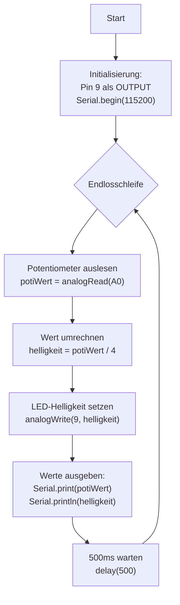

# Übungsbeispiel 0: LED-Helligkeitssteuerung mit Potentiometer - Lösung

## Flussdiagramm

- Initialisierung (Pins, Serial) - optional
- Hauptschleife mit:
  - Potentiometer auslesen
  - Wert umrechnen
  - LED-Helligkeit setzen
  - Werte ausgeben
  - Verzögerung



---

## Lösung

```cpp
// Pin-Definitionen
const int LED_PIN = 9;       // PWM-fähiger Pin
const int POTI_PIN = A0;     // Analoger Eingang

void setup() {
  // Pin-Konfiguration
  pinMode(LED_PIN, OUTPUT);
  
  // Serielle Kommunikation starten
  Serial.begin(115200);
  
  // Willkommensnachricht
  Serial.println("LED-Helligkeitssteuerung mit Potentiometer");
  Serial.println("------------------------------------------");
  Serial.println("Poti-Wert | LED-Helligkeit");
}

void loop() {
  // Potentiometer auslesen (0-1023)
  int potiWert = analogRead(POTI_PIN);
  
  // Wert auf LED-Helligkeit umrechnen (0-255)
  int helligkeit = potiWert / 4;
  
  // LED-Helligkeit setzen
  analogWrite(LED_PIN, helligkeit);
  
  // Werte auf Serial Monitor ausgeben
  Serial.print("   ");
  Serial.print(potiWert);
  Serial.print("    |      ");
  Serial.println(helligkeit);
  
  // 500ms warten
  delay(500);
}
```

---

## Erklärung

### Initialisierung (setup):
- **`pinMode(LED_PIN, OUTPUT)`**: LED-Pin als Ausgang konfigurieren
- **`Serial.begin(115200)`**: Serielle Kommunikation mit 115200 Baud starten
- **Hinweis**: Analoge Pins (A0) müssen nicht mit `pinMode()` konfiguriert werden

### Hauptschleife (loop):

**Potentiometer auslesen:**
- **`analogRead(A0)`**: Liest den analogen Wert am Pin A0 (0-1023)
- 10-Bit Auflösung: 0V = 0, 5V = 1023

**Wert umrechnen:**
- **Division durch 4**: Rechnet 0-1023 auf 0-255 um (1024/4 = 256)
- Alternative: `map(potiWert, 0, 1023, 0, 255)`

**LED-Helligkeit setzen:**
- **`analogWrite(LED_PIN, helligkeit)`**: Setzt PWM-Signal (0-255)
- 0 = LED aus, 255 = LED volle Helligkeit
- PWM-Frequenz: ca. 490 Hz (Arduino Uno)

**Serielle Ausgabe:**
- **`Serial.print()`**: Gibt Text/Wert ohne Zeilenumbruch aus
- **`Serial.println()`**: Gibt Text/Wert mit Zeilenumbruch aus
- Formatierte Ausgabe für bessere Lesbarkeit

### Programmablauf:
1. Potentiometer wird kontinuierlich ausgelesen
2. Wert wird auf LED-Bereich umgerechnet
3. LED-Helligkeit wird entsprechend gesetzt
4. Werte werden alle 500ms ausgegeben
5. Schleife wiederholt sich endlos
