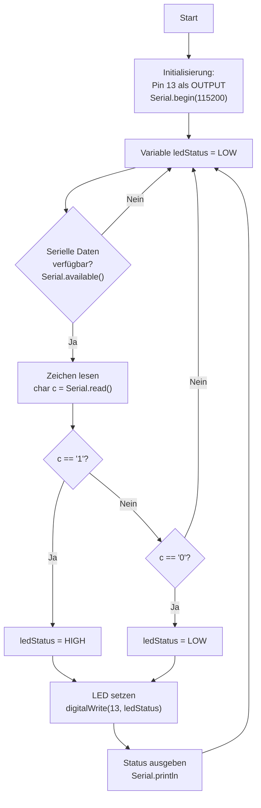

# Übungsbeispiel 1a: LED-Steuerung über serielle Eingabe - Lösung

## Flussdiagramm

- Initialisierung (Pin, Serial) - optional
- Hauptschleife mit:
  - Serielle Eingabe prüfen
  - Zeichen auswerten ('1'/'0')
  - LED setzen und Status ausgeben



---

## Lösung

```cpp
// Pin-Definition
const int LED_PIN = 13;

// LED-Status
int ledStatus = LOW;

void setup() {
  pinMode(LED_PIN, OUTPUT);
  Serial.begin(115200);
  Serial.println("LED-Seriell-Steuerung gestartet (1=Ein, 0=Aus)");
}

void loop() {
  // Serielle Eingabe prüfen
  if (Serial.available() > 0) {
    char eingabe = Serial.read();

    if (eingabe == '1') {
      ledStatus = HIGH;
      digitalWrite(LED_PIN, ledStatus);
      Serial.println("LED eingeschaltet (Seriell)");
    } else if (eingabe == '0') {
      ledStatus = LOW;
      digitalWrite(LED_PIN, ledStatus);
      Serial.println("LED ausgeschaltet (Seriell)");
    }
  }
}
```

---

## Erklärung

- **Serielle Prüfung**: `Serial.available()` stellt fest, ob Daten anliegen
- **Zeichen lesen**: `Serial.read()` liest genau ein Zeichen
- **LED-Steuerung**: '1' → ein, '0' → aus
- **Rückmeldung**: Status wird mit `Serial.println()` ausgegeben
