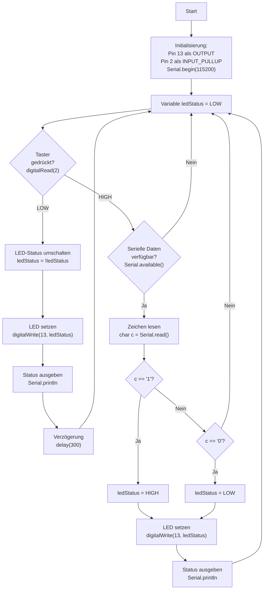

# Übungsbeispiel 1b: LED-Steuerung mit Taster und serieller Eingabe - Lösung

## Flussdiagramm

- Initialisierung (Pins, Serial) - optional
- Hauptschleife mit:
  - Taster-Abfrage (Flankenerkennung)
  - Serielle Eingabe prüfen
  - LED-Steuerung
  - Status-Ausgabe



---

## Lösung

```cpp
// Pin-Definitionen
const int LED_PIN = 13;
const int BUTTON_PIN = 2;

// Variablen für LED-Status und Taster-Zustand
int ledStatus = LOW;
int lastButtonState = HIGH;

void setup() {
  // Pin-Konfiguration
  pinMode(LED_PIN, OUTPUT);
  pinMode(BUTTON_PIN, INPUT_PULLUP);
  
  // Serielle Kommunikation starten
  Serial.begin(115200);
  
  // Willkommensnachricht
  Serial.println("LED-Steuerung gestartet");
  Serial.println("Taster: LED umschalten");
  Serial.println("Seriell: '1' = Ein, '0' = Aus");
  Serial.println("------------------------");
}

void loop() {
  // Taster-Abfrage
  int buttonState = digitalRead(BUTTON_PIN);
  
  // Wenn Taster gedrückt wird (Flanke HIGH -> LOW)
  if (buttonState == LOW && lastButtonState == HIGH) {
    // LED-Status umschalten (Toggle)
    ledStatus = !ledStatus;
    digitalWrite(LED_PIN, ledStatus);
    
    // Status ausgeben
    if (ledStatus == HIGH) {
      Serial.println("LED eingeschaltet (Taster)");
    } else {
      Serial.println("LED ausgeschaltet (Taster)");
    }
    
    // Kurze Verzögerung um zu schnelles Umschalten zu verhindern
    delay(300);
  }
  
  // Taster-Zustand speichern
  lastButtonState = buttonState;
  
  // Serielle Eingabe prüfen
  if (Serial.available() > 0) {
    char eingabe = Serial.read();
    
    // LED einschalten bei '1'
    if (eingabe == '1') {
      ledStatus = HIGH;
      digitalWrite(LED_PIN, ledStatus);
      Serial.println("LED eingeschaltet (Seriell)");
    }
    // LED ausschalten bei '0'
    else if (eingabe == '0') {
      ledStatus = LOW;
      digitalWrite(LED_PIN, ledStatus);
      Serial.println("LED ausgeschaltet (Seriell)");
    }
  }
}
```

---

## Erklärung

- **Taster mit Pull-Up**: Nicht gedrückt = HIGH, gedrückt = LOW
- **Flankenerkennung**: `lastButtonState` erkennt den Moment des Drückens
- **Toggle-Logik**: `ledStatus = !ledStatus`
- **Serielle Steuerung**: '1' schaltet ein, '0' schaltet aus
- **Entprellung**: einfache Verzögerung mit `delay(300)`
