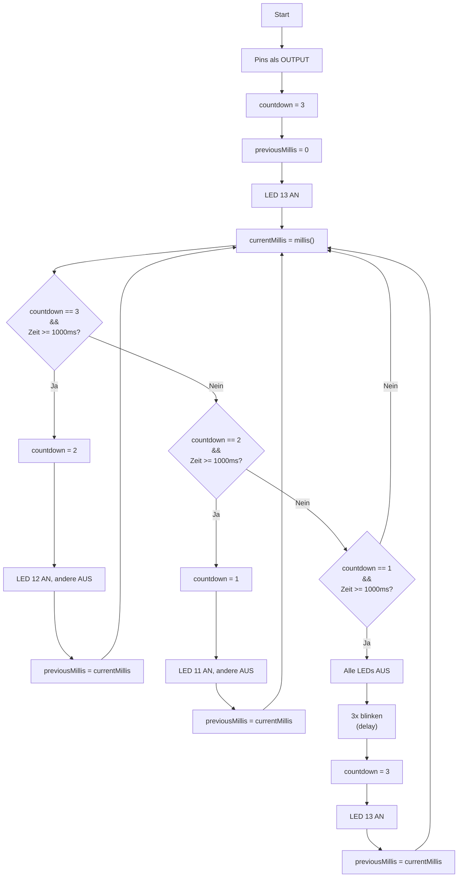

# Übungsbeispiel 2a: Countdown mit Lauflicht - Lösung

## Flussdiagramm



---

## Lösung

```cpp
// Pin-Definitionen
const int LED1_PIN = 11;
const int LED2_PIN = 12;
const int LED3_PIN = 13;

// Zeitvariablen
unsigned long previousMillis = 0;
int countdown = 3;  // 3, 2, 1, 0

void setup() {
  pinMode(LED1_PIN, OUTPUT);
  pinMode(LED2_PIN, OUTPUT);
  pinMode(LED3_PIN, OUTPUT);
  
  // Start bei 3
  digitalWrite(LED1_PIN, LOW);
  digitalWrite(LED2_PIN, LOW);
  digitalWrite(LED3_PIN, HIGH);
}

void loop() {
  unsigned long currentMillis = millis();
  
  // Countdown-Logik mit switch-case
  if (currentMillis - previousMillis >= 1000) {
    previousMillis = currentMillis;
    
    switch (countdown) {
      case 3:
        countdown = 2;
        digitalWrite(LED1_PIN, LOW);
        digitalWrite(LED2_PIN, HIGH);
        digitalWrite(LED3_PIN, LOW);
        break;
        
      case 2:
        countdown = 1;
        digitalWrite(LED1_PIN, HIGH);
        digitalWrite(LED2_PIN, LOW);
        digitalWrite(LED3_PIN, LOW);
        break;
        
      case 1:
        digitalWrite(LED1_PIN, LOW);
        digitalWrite(LED2_PIN, LOW);
        digitalWrite(LED3_PIN, LOW);
        
        // 3x blinken
        for (int i = 0; i < 3; i++) {
          digitalWrite(LED1_PIN, HIGH);
          digitalWrite(LED2_PIN, HIGH);
          digitalWrite(LED3_PIN, HIGH);
          delay(200);
          digitalWrite(LED1_PIN, LOW);
          digitalWrite(LED2_PIN, LOW);
          digitalWrite(LED3_PIN, LOW);
          delay(200);
        }
        
        // Neustart
        countdown = 3;
        digitalWrite(LED3_PIN, HIGH);
        break;
    }
  }
}
```

---

## Erklärung

- **switch-case Struktur**: Klare Zuordnung der Aktionen zu jedem Countdown-Wert
- **Countdown-Logik**: Variable `countdown` läuft von 3 über 2, 1 bis zur Wiederholung
- **Lauflicht**: Jede LED leuchtet nacheinander (Pin 13 → 12 → 11)
- **millis()-Technik**: Nicht-blockierende Zeitsteuerung für das Lauflicht
- **Blinken**: Bei 0 blinken alle LEDs 3x mit `delay()` (kurze Blockierung ist hier akzeptabel)
- **Neustart**: Nach dem Blinken startet der Countdown automatisch wieder bei 3
