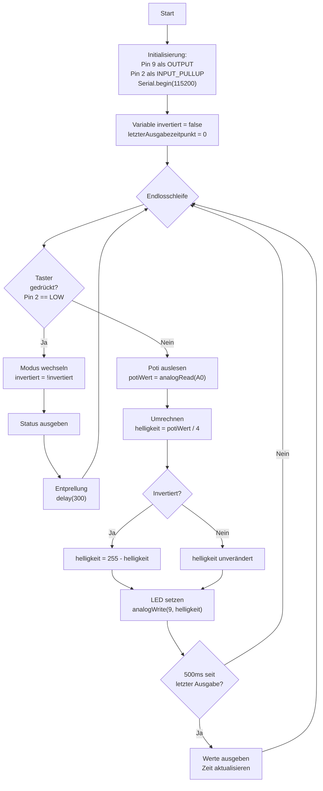

# Übungsbeispiel 3: LED-Helligkeitssteuerung mit Invertierung - Lösung

## Flussdiagramm

- Initialisierung (Pins, Serial, Variablen) - optional
- Hauptschleife mit:
  - Taster-Abfrage
  - Potentiometer auslesen
  - Wert umrechnen
  - Invertierung anwenden (falls aktiv)
  - LED-Helligkeit setzen
  - Werte ausgeben



---

## Lösung

```cpp
// Pin-Definitionen
const int LED_PIN = 9;
const int POTI_PIN = A0;
const int BUTTON_PIN = 2;

// Zustandsvariablen
bool invertiert = false;
int lastButtonState = HIGH;

// Für zeitgesteuerte Ausgabe
unsigned long letzteAusgabe = 0;
const unsigned long AUSGABE_INTERVALL = 500;

void setup() {
  // Pin-Konfiguration
  pinMode(LED_PIN, OUTPUT);
  pinMode(BUTTON_PIN, INPUT_PULLUP);
  
  // Serielle Kommunikation starten
  Serial.begin(115200);
  
  // Willkommensnachricht
  Serial.println("LED-Helligkeitssteuerung mit Invertierung");
  Serial.println("-----------------------------------------");
  Serial.println("Taster: Modus wechseln (Normal/Invertiert)");
  Serial.println();
  zeigeModus();
  Serial.println("Poti | Helligkeit | Modus");
}

void loop() {
  // Taster abfragen (Invertierung)
  int buttonState = digitalRead(BUTTON_PIN);
  if (buttonState == LOW && lastButtonState == HIGH) {
    invertiert = !invertiert;
    zeigeModus();
    delay(300);  // Entprellung
  }
  lastButtonState = buttonState;
  
  // Potentiometer auslesen (0-1023)
  int potiWert = analogRead(POTI_PIN);
  
  // Wert auf LED-Helligkeit umrechnen (0-255)
  int helligkeit = potiWert / 4;
  
  // Invertierung anwenden, falls aktiv
  if (invertiert) {
    helligkeit = 255 - helligkeit;
  }
  
  // LED-Helligkeit setzen
  analogWrite(LED_PIN, helligkeit);
  
  // Werte alle 500ms ausgeben
  unsigned long aktuelleZeit = millis();
  if (aktuelleZeit - letzteAusgabe >= AUSGABE_INTERVALL) {
    Serial.print(" ");
    Serial.print(potiWert);
    Serial.print("  |    ");
    Serial.print(helligkeit);
    Serial.print("     | ");
    Serial.println(invertiert ? "Invertiert" : "Normal");
    
    letzteAusgabe = aktuelleZeit;
  }
}

void zeigeModus() {
  Serial.println("--- Modus gewechselt ---");
  Serial.print("Aktueller Modus: ");
  Serial.println(invertiert ? "INVERTIERT" : "NORMAL");
  Serial.println();
}
```

---

## Erklärung

### Initialisierung (setup):
- **LED-Pin**: Als OUTPUT für PWM
- **Taster-Pin**: Mit `INPUT_PULLUP` konfiguriert
- **Funktion `zeigeModus()`**: Gibt aktuellen Modus aus

### Hauptschleife (loop):

**Taster-Abfrage:**
- Erkennt Flanke HIGH → LOW (Tastendruck)
- Wechselt zwischen Normal- und Invertiert-Modus
- `invertiert = !invertiert` schaltet Boolean um

**Potentiometer auslesen:**
- **`analogRead(A0)`**: Liest Wert 0-1023
- **Division durch 4**: Umrechnung auf 0-255

**Invertierung:**
- **Normal**: `helligkeit = potiWert / 4`
- **Invertiert**: `helligkeit = 255 - (potiWert / 4)`
- Beispiel: Poti=1023 → hell=255 → invertiert=0 (dunkel)

**LED-Steuerung:**
- **`analogWrite(LED_PIN, helligkeit)`**: Setzt PWM-Wert

**Zeitgesteuerte Ausgabe:**
- **`millis()`**: Gibt Millisekunden seit Programmstart zurück
- **Intervall-Check**: Ausgabe nur alle 500ms
- Verhindert Überlastung des Serial Monitors
- Genauer als `delay()`, da Programm nicht blockiert

**Hilfsfunktion zeigeModus():**
- Wird bei Moduswechsel aufgerufen
- Zeigt aktuellen Modus deutlich an

### Programmablauf:
1. Taster wird kontinuierlich auf Moduswechsel geprüft
2. Potentiometer wird ausgelesen
3. Helligkeit wird berechnet (normal oder invertiert)
4. LED wird entsprechend gesteuert
5. Werte werden alle 500ms ausgegeben ohne das Programm zu blockieren

### Besonderheiten:
- **Non-blocking Timing**: Verwendung von `millis()` statt `delay()` für Ausgabe
- **Toggle-Funktion**: Einfacher Moduswechsel mit Boolean
- **Invertierung**: Mathematisch einfach durch Subtraktion von 255
