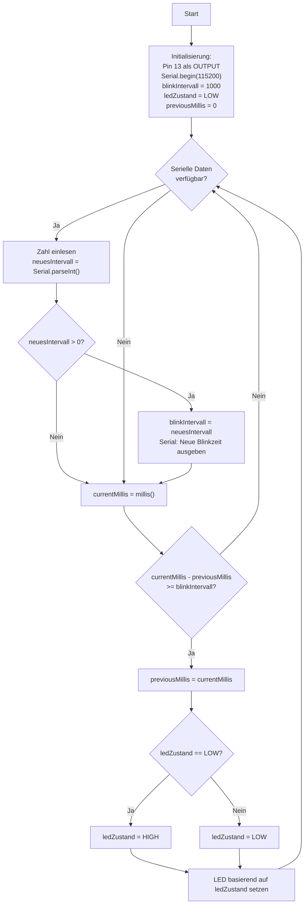

# Übungsbeispiel 3a: LED-Blinken mit variabler Frequenz - Lösung

## Flussdiagramm



---

## Lösung

```cpp
// Pin-Definition
const int LED_PIN = 13;

// Zeitvariablen
unsigned long previousMillis = 0;
unsigned long blinkIntervall = 1000;  // Standard: 1000ms
int ledZustand = LOW;

void setup() {
  pinMode(LED_PIN, OUTPUT);
  Serial.begin(115200);
  Serial.println("LED-Blinken mit variabler Frequenz");
  Serial.println("Gib eine Zahl (in ms) ein, um die Blinkzeit zu ändern");
  Serial.print("Aktuelle Blinkzeit: ");
  Serial.print(blinkIntervall);
  Serial.println("ms");
}

void loop() {
  // Serielle Eingabe prüfen
  if (Serial.available() > 0) {
    unsigned long neuesIntervall = Serial.parseInt();
    
    if (neuesIntervall > 0) {
      blinkIntervall = neuesIntervall;
      Serial.print("Neue Blinkzeit: ");
      Serial.print(blinkIntervall);
      Serial.println("ms");
    }
  }
  
  // LED-Blinken mit millis()
  unsigned long currentMillis = millis();
  
  if (currentMillis - previousMillis >= blinkIntervall) {
    previousMillis = currentMillis;
    
    // LED-Zustand umschalten
    if (ledZustand == LOW) {
      ledZustand = HIGH;
    } else {
      ledZustand = LOW;
    }
    
    digitalWrite(LED_PIN, ledZustand);
  }
}
```

---

## Erklärung

- **millis()-Technik**: Die LED blinkt ohne `delay()`, das Programm bleibt responsiv
- **Serial.parseInt()**: Liest eine Zahl von der seriellen Schnittstelle
- **Dynamische Anpassung**: Die Blinkfrequenz kann jederzeit geändert werden
- **Zustandswechsel**: Bei jedem Intervallablauf wird der LED-Zustand umgeschaltet (LOW↔HIGH)
