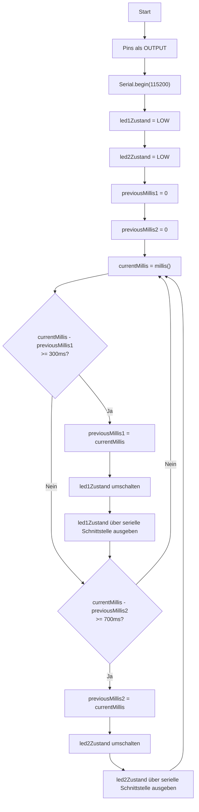

# Übungsbeispiel 3b: Zwei unabhängig blinkende LEDs - Lösung

## Flussdiagramm



---

## Lösung

```cpp
// Pin-Definitionen
const int LED1_PIN = 12;
const int LED2_PIN = 13;

// Zeitvariablen für LED 1
unsigned long previousMillis1 = 0;
const unsigned long intervall1 = 300;
int led1Zustand = LOW;

// Zeitvariablen für LED 2
unsigned long previousMillis2 = 0;
const unsigned long intervall2 = 700;
int led2Zustand = LOW;

void setup() {
  pinMode(LED1_PIN, OUTPUT);
  pinMode(LED2_PIN, OUTPUT);
  
  Serial.begin(115200);
  Serial.println("Zwei unabhängig blinkende LEDs");
  Serial.println("LED1 (Pin 12): 300ms | LED2 (Pin 13): 700ms");
}

void loop() {
  unsigned long currentMillis = millis();
  
  // LED 1 verwalten (300ms)
  if (currentMillis - previousMillis1 >= intervall1) {
    previousMillis1 = currentMillis;
    
    // Zustand umschalten
    if (led1Zustand == LOW) {
      led1Zustand = HIGH;
    } else {
      led1Zustand = LOW;
    }
    
    digitalWrite(LED1_PIN, led1Zustand);
    Serial.print("LED1: ");
    Serial.println(led1Zustand == HIGH ? "AN" : "AUS");
  }
  
  // LED 2 verwalten (700ms)
  if (currentMillis - previousMillis2 >= intervall2) {
    previousMillis2 = currentMillis;
    
    // Zustand umschalten
    if (led2Zustand == LOW) {
      led2Zustand = HIGH;
    } else {
      led2Zustand = LOW;
    }
    
    digitalWrite(LED2_PIN, led2Zustand);
    Serial.print("LED2: ");
    Serial.println(led2Zustand == HIGH ? "AN" : "AUS");
  }
}
```

---

## Erklärung

- **Unabhängige Zeitsteuerung**: Jede LED hat eigene `previousMillis` und `intervall` Variablen
- **Paralleles Blinken**: Beide LEDs laufen gleichzeitig mit unterschiedlichen Frequenzen
- **millis()-Technik**: Keine Blockierung durch `delay()`, beide LEDs können unabhängig agieren
- **Separate Prüfung**: In jeder `loop()`-Iteration wird für beide LEDs geprüft, ob ihr Intervall abgelaufen ist
