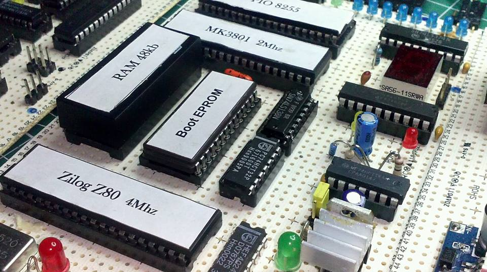
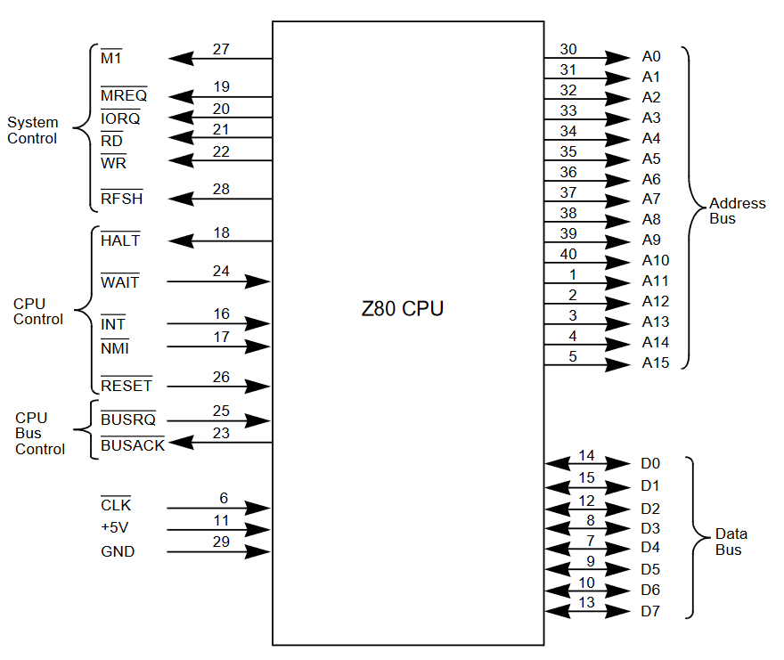
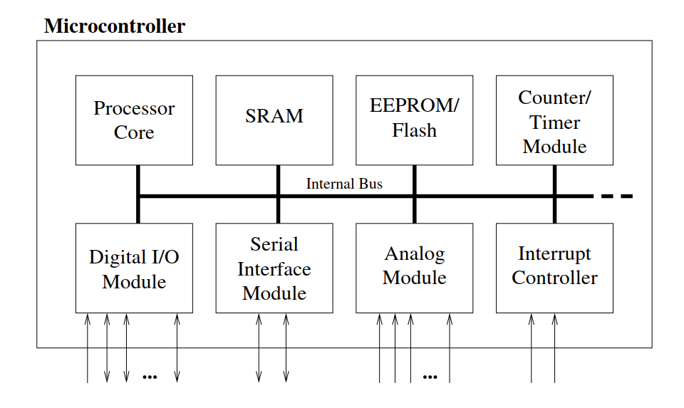
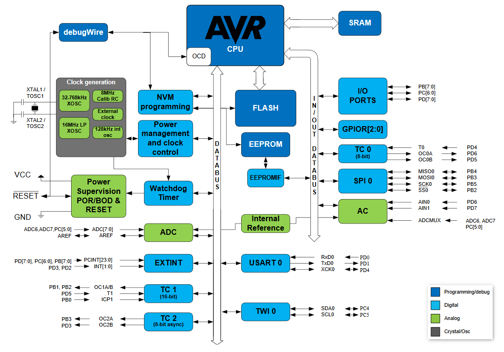

# Einführung

Das Programmieren mit der Arduino-IDE und Bibliotheken versteckt die Komplexität der Mikrocontroller‑Hardware und suggeriert, dass wir für einfache Projekte nicht mit Hardware und Datenblättern arbeiten müssen. Mit wachsender Komplexität und Professionalität unserer Projekte müssen wir uns jedoch mit der Mikrocontroller‑Hardware beschäftigen und diese zumindest verstehen.

In diesem Skript fokussieren wir auf 8‑Bit‑AVR‑Mikrocontroller von Atmel. Der grundsätzliche Ansatz ist jedoch bei anderen Herstellern ähnlich. Um alles aus dem Mikrocontroller herauszuholen, lohnt sich ein tiefer Blick in die Hardware. Obwohl es sehr mächtige objektorientierte Programmiersprachen wie C++ gibt, ist die meistgenutzte Sprache für Mikrocontroller C. Tatsächlich ist die AVR‑Architektur (im Vergleich zu PIC‑Mikrocontrollern) stark auf C optimiert. Noch ein tieferer Einstieg wäre (Inline-)Assembler, jedoch sind C-Compiler so effizeint, dass dies nicht mehr benötigt wird. Gerade in Zeiten der voranschreitenden KI wird auch die C-Programmierung nicht mehr so fundiert wie bisher benötigt, es führt jedoch kein Weg daran vorbei zu verstehen warum und wie so ein Microcontroller arbeitet und programmiert wird.

## Mikroprozessor vs. Mikrocontroller
Die Begriffe Mikroprozessor und Mikrocontroller werden oft verwechselt. Was ist der Unterschied? Einer der bekanntesten 8‑Bit‑Mikroprozessoren ist der Z80 von Zilog. Die erste Version erschien 1976 und lief mit 2,5 MHz; spätere Versionen erlaubten bis zu 20 MHz. Der Prozessor selbst enthält die Steuereinheit, die ALU sowie interne Register und Flags. Seine Pins werden hauptsächlich als Adress‑ und Datenbus für externe Peripherie‑Bausteine genutzt. Ohne RAM und ROM ergibt ein Prozessor allein wenig Sinn.

Die folgende Abbildung zeigt den Z80 mit verschiedenen Peripherie‑Modulen (z. B. Boot‑EPROM, RAM, Timer, PIO 8255):

Der Aufbau einer solchen Schaltung ist aufwendig, und die Umsetzung auf einer Leiterplatte benötigt viel Platz. Daher entstand die Idee, all dies auf einem einzigen Chip zu integrieren: den Mikrocontroller. Beim ATmega328p wird der Unterschied deutlich: Der Mikrocontroller enthält Prozessor, Speicher (RAM, ROM, EEPROM), Timer, Ports und viele weitere Komponenten auf einem Chip. Das reduziert die PCB‑Größe, spart Entwicklungszeit und Kosten. Außerdem führt eine kleinere Chipgröße zu geringerem Energieverbrauch, kürzeren Signallaufzeiten und höherer Zuverlässigkeit.

Nachteilig ist, dass eine Software‑Lösung auf einem Mikrocontroller nicht die Geschwindigkeit einer reinen Hardware‑Lösung erreicht. Anwendungen mit extrem kurzen Reaktionszeiten verlangen daher oft weiterhin Hardware. Für die meisten Anwendungen – insbesondere mit menschlicher Interaktion (Mikrowelle, Heizungsregelung) – sind Mikrocontroller jedoch ideal.

Auch an den Pinouts erkennt man den Unterschied: Der Z80 besitzt Adresspins (A0–A15) und Datenpins (D0–D7).

Der Mikrocontroller ATmega328p führt keine Adress‑ oder Datenpins nach außen, sondern stellt sogenannte Port‑Pins (Px0–Px7) bereit. Diese I/O‑Pins können – über interne Peripherie – für verschiedene Zwecke verwendet werden.

Historisch verbreitet waren z. B. Motorolas 68HCxx‑Serie sowie Intels 8048/8051. 8‑Bit‑Mikrocontroller sind bis heute gefragt. Durch den Arduino‑Hype wurden AVR‑Controller (z. B. ATmega328p) sehr bekannt. Andere Hersteller wie Microchip (PIC) oder Freescale haben ebenfalls viele gängige 8‑Bit‑Controller im Portfolio. Atmel wurde 2017 von Microchip übernommen.

## Überblick über Mikrocontroller‑Module
Der grundsätzliche Aufbau von Mikrocontrollern ist ähnlich. Die folgende Abbildung zeigt ein Blockschaltbild: Alle Komponenten sind über einen internen Bus verbunden und auf einem Chip integriert. Die Module sind über I/O‑Pins mit der Außenwelt verbunden.

Typische Module eines Mikrocontrollers (Details folgen in späteren Abschnitten):

- Prozessor‑Kern: CPU mit ALU, Steuereinheit und Registern (Stack‑Pointer, Program‑Counter, Akkumulator, Registersatz …)
- Speicher: Häufig getrennt in Programm‑ und Datenspeicher; in größeren Controllern übernimmt ein DMA‑Controller Transfers zwischen Peripherie und Speicher.
- Interrupt‑Controller: Unterbricht den Programmfluss bei wichtigen externen oder internen Ereignissen; zusammen mit Sleep‑Modi hilft dies, Energie zu sparen.
- Digitale I/O: Parallele digitale Ports sind ein Hauptmerkmal von Mikrocontrollern; die Anzahl reicht von wenigen bis über 90 Pins.
- Analoge I/O: Meist integriert (A/D‑Wandler mit 8–12 Bit, Analogkomparator; teils D/A‑Wandler).
- Timer/Counter: Meist 2–3 Timer/Counter zum Zeit messen und Zählen; häufig PWM‑Ausgänge (z. B. für Motoren oder als einfacher D/A‑Wandler mit Filter).
- Schnittstellen: Serielle Schnittstellen (UART, SPI, I²C, CAN), teils USB oder Ethernet.
- Watchdog‑Timer: Setzt den Controller bei Software‑"Abstürzen" zurück.
- Debug‑Einheit: Hardware für Remote‑Debugging vom PC ohne spezielles Debug‑Programm.

Im Vergleich zu Prozessoren besitzen (kleinere) Controller keine MMU, eine einfache Pipeline und keine Caches – aus Kosten‑ und Echtzeit‑Gründen.

Für den ATmega328p zeigt die folgende Abbildung die Peripherie‑Komponenten:

