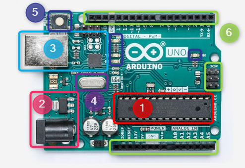

# Grundaufbau

Ein Mikrocontroller wie der ATmega328p benötigt mindestens eine Basisschaltung, um zu funktionieren. Verwechsle dies nicht mit einem Entwicklungsboard wie dem Arduino – dort sind diese Komponenten bereits integriert.

Gute Einstiege zum Grundaufbau eines AVR‑Mikrocontrollers:
- https://www.kreatives-chaos.com/artikel/avr-grundschaltungen
- https://rn-wissen.de/wiki/index.php/Abblockkondensator

Die folgende Abbildung und Tabelle zeigen, warum Entwicklungsboards so praktisch sind.

| Nr. | Teil |
|---:|---|
| 1 | Haupt‑Mikrocontroller ATmega328p |
| 2 | Stromversorgung (Hohlstecker) und Spannungsregler |
| 3 | USB‑Stromversorgung und seriell‑zu‑USB‑Wandler (Chip für Programmierung via USB) |
| 4 | Quarzoszillator mit den benötigten Kondensatoren |
| 5 | Reset‑Taster und Status‑LEDs |
| 6 | Pin‑Header für Jumper‑Leitungen und 6‑Pin‑ICSP‑Stecker (direkte ISP‑Programmierung) |
