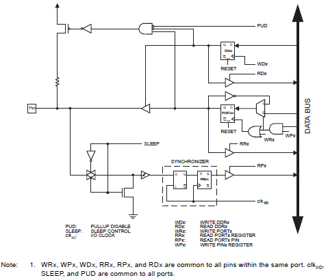
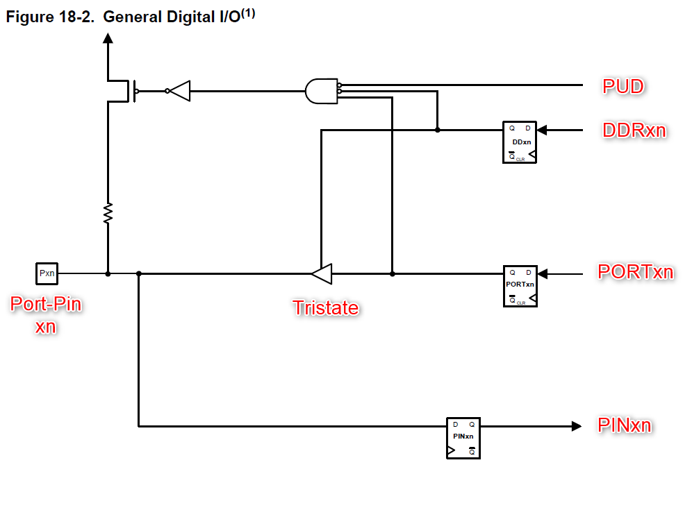
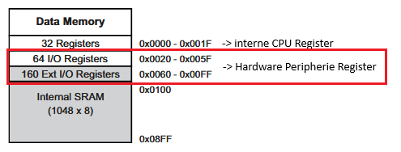
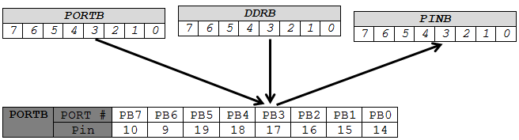

# I/O‑Ports

Der ATmega328p besitzt drei digitale I/O‑Ports (PORTB, PORTC, PORTD) mit jeweils bis zu 8 nutzbaren Pins. Die folgende Grafik zeigt den allgemeinen Aufbau eines digitalen I/O‑Ports:

Die Tabellen zeigen die Port‑Bezeichnungen, die entsprechenden DIL‑Pins des ATmega‑Chips sowie die Arduino‑Pins.

## PORTB

| Port # | PB7 | PB6 | PB5 | PB4 | PB3 | PB2 | PB1 | PB0 |
|---:|:---:|:---:|:---:|:---:|:---:|:---:|:---:|:---:|
| ATmega328p‑Pin | (Osz) | (Osz) | 19 | 18 | 17 | 16 | 15 | 14 |
| Arduino‑Pin | n/a | n/a | 13 | 12 | 11 | 10 | 9 | 8 |

## PORTC

| Port # | PC7 | PC6 | PC5 | PC4 | PC3 | PC2 | PC1 | PC0 |
|---:|:---:|:---:|:---:|:---:|:---:|:---:|:---:|:---:|
| ATmega328p‑Pin | n/a | (RESET) | 28 | 27 | 26 | 25 | 24 | 23 |
| Arduino‑Pin | n/a | n/a | A5 | A4 | A3 | A2 | A1 | A0 |

## PORTD

| Port # | PD7 | PD6 | PD5 | PD4 | PD3 | PD2 | PD1 | PD0 |
|---:|:---:|:---:|:---:|:---:|:---:|:---:|:---:|:---:|
| ATmega328p‑Pin | 13 | 12 | 11 | 6 | 5 | 4 | 3 RXD | 2 TXD |
| Arduino‑Pin | 7 | 6 | 5 | 4 | 3 | 2 | 1 RX | 0 TX |

Hier noch eine graphische Darstellung des Mappings:

## Vereinfachtes Port‑Pin‑Modell
Eine noch vereinfachtere Darstellung eines einzelnen I/O‑Port‑Pins ist in folgender Abbildung gezeigt. Hier lassen sich leicht die drei D‑Flip‑Flops identifizieren. Dabei handelt es sich um eine einzelne konkrete SRAM‑Datenzelle im Speicher, der direkten Einfluss auf die Hardware hat. Je nachdem, ob diese Zellen 1 oder 0 sind, verhält sich der Port‑Pin unterschiedlich. Mit anderen Worten wird das Hardware‑Verhalten durch das Konfigurieren über die Software (schreiben eines Wertes auf das entsprechende Register). Das x wird für den Port (B, C oder D) und n für die Position (Bit 0 – 7) verwendet.

Kernbaustein ist der sogenannte Tristate-Bauteil, das den Pin als Eingang oder Ausgang schaltet. Die Ersatzschaltung des Tri-State ist in folgender Abbildung ersichtlich. Das Verhalten entspricht dem eines Schalters und hat als dritten Zustand (State) = hochohmig (Schalter geöffnet).

| A (IN) | B (IN) | C (OUT) |
|:---:|:---:|:---:|
| 0 | 1 | 0 |
| 1 | 1 | 1 |
| X | 0 | Z (hochohmig) |

## Zugehörige Register

**Definition**: Ein Register (bei Mikrocontrollern) ist ein sehr kleiner, sehr schneller Speicherplatz direkt in der CPU oder in der Hardware-Peripherie.

Man benutzt **Register**, um Hardware direkt zu steuern oder den Status zu lesen. Register sind sozusagen die direkten Bedienelemente der Hardware.

Um ein Port entsprechend zu konfigurieren werden die folgenden Register benötigt:
- Datenrichtungsregister (Data Direction Register): `DDRB`, `DDRC`, `DDRD` (Port als Eingang/Ausgang konfigurieren)
- Port‑Register: `PORTB`, `PORTC`, `PORTD` (Ausgang schreiben; bei Eingang: Pull‑Up aktivieren)
- Pin‑Register: `PINB`, `PINC`, `PIND` (Eingang lesen)

Aktiviert man einen Port als Eingang, kann über das Setzen von `PORTx` der interne Pull‑Up‑Widerstand zugeschaltet werden. Soll dies global verhindert werden (z. B. bei Umschalten von Ausgang High auf Eingang), kann das `PUD`‑Bit in `MCUCR` gesetzt werden.

### Pin‑Konfiguration (bei aktivem `PUD`)

| `DDRxn` | `PORTxn` | Modus | Pin‑Level | Pull‑Up |
|:---:|:---:|:---:|:---:|:---:|
| 1 | 0 | Ausgang | 0 | Nein |
| 1 | 1 | Ausgang | 1 | Nein |
| 0 | 0 | Eingang | – | Nein |
| 0 | 1 | Eingang | – | Ja |
