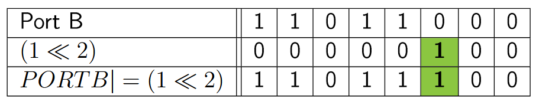
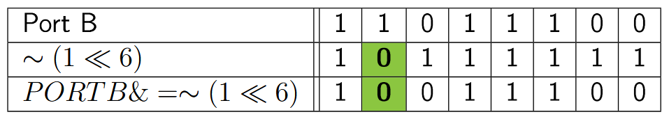
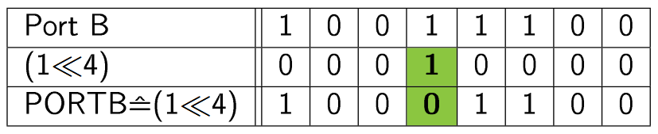
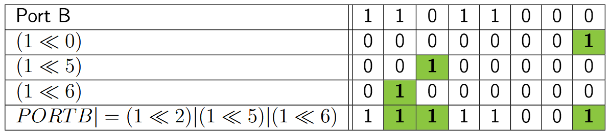

# Bitmanipulation

In diesem Abschnitt betrachten wir, wie einzelne Bits in Registern verändert werden, ohne den Rest zu beeinflussen.

## Left-Shift und Right-Shift

- Left Shift: `1 << i` verschiebt eine `1` um `i` Positionen nach links.
- Right Shift: `1 >> i` verschiebt eine `1` um `i` Positionen nach rechts.

## Bits setzen (OR)

Mit bitweisem OR lässt sich ein einzelnes Bit setzen. Beispiel: PB2 auf High setzen:

```c
PORTB = PORTB | (1 << 2);
```


## Bits löschen (AND mit NOT)

Mit bitweisem AND und invertierter Maske wird ein Bit gelöscht. Beispiel: PB6 löschen:

```c
PORTB = PORTB & ~(1 << 6);
```


## Bits toggeln (XOR)

Mit bitweisem XOR lässt sich ein Bit invertieren. Beispiel: PB4 toggeln:

```c
PORTB = PORTB ^ (1 << 4);
```


## Mehrere Bits gleichzeitig ändern

Mehrere Bits lassen sich kombinieren:

```c
PORTB = PORTB | (1 << 0) | (1 << 5) | (1 << 6);
```


## Makros

Makros sind Textersetzungen des Präprozessors und erleichtern das Schreiben wiederkehrender Operationen.

Bereits bekannte Beispiele sind so genannte "Hash Defines":

```c
#define LENGTH 20

void main()
{
    for (int i; i < LENGTH; i++)
    {
        // ...
    }
}
```

wird vom Präprozessor ersetzt zu 

```c
void main()
{
    for (int i; i < 20; i++)
    {
        // ...
    }
}
```

Nützliches Makro ist der sogenannte Bitvektor:

```c
#define _BV(bit) (1<<(bit))
```

Oder man schreibt sich auch selber welche:

```c
#ifndef SET_BIT
#define SET_BIT(REG, BIT)        (REG |=  (1 << (BIT)))
#endif

#ifndef CLEAR_BIT
#define CLEAR_BIT(REG, BIT)      (REG &= ~(1 << (BIT)))
#endif

#ifndef TOGGLE_BIT
#define TOGGLE_BIT(REG, BIT)     (REG ^=  (1 << (BIT)))
#endif

#ifndef GET_BIT
#define GET_BIT(REG, BIT)        ((REG & (1 << (BIT))) >> (BIT))
#endif
```

Angewandt auf das „Hello World“‑Beispiel (LED blinken):

```c
/* Auszug: blinking_led_delay_macros.ino */
#ifndef F_CPU
#define F_CPU 16000000UL
#endif

#include <avr/io.h>
#include <util/delay.h>

int main(void)
{
    SET_BIT(DDRB, PB5);          // PB5 als Ausgang

    while (1)
    {
        SET_BIT(PORTB, PB5);     // LED an
        _delay_ms(900);

        CLEAR_BIT(PORTB, PB5);   // LED aus
        _delay_ms(100);
    }

    return 0;
}
```

## Von einem digitalen I/O‑Pin lesen

Im folgenden Beispiel wird ein Tastereingang gelesen; die LED blinkt nur, wenn der Taster gedrückt ist.

Verwendete Header mit Bit‑Makros (lokale Datei, daher mit "..."):

```c
/* Datei: bit_macros.h */
#ifndef SET_BIT
#define SET_BIT(PORT, BIT)   (PORT |=  (1 << (BIT)))
#endif
#ifndef CLEAR_BIT
#define CLEAR_BIT(PORT, BIT) (PORT &= ~(1 << (BIT)))
#endif
#ifndef TOGGLE_BIT
#define TOGGLE_BIT(PORT, BIT) (PORT ^= (1 << (BIT)))
#endif
#ifndef GET_BIT
#define GET_BIT(PORT, BIT)   ((PORT & (1 << (BIT))) >> (BIT))
#endif
```

Hauptprogramm (Auszug):

```c
#ifndef F_CPU
#define F_CPU 16000000UL
#endif

#include <avr/io.h>
#include <util/delay.h>
#include "bit_macros.h"

#define LED_DDR      DDRB
#define LED_PORT     PORTB
#define LED_PIN      PB5

#define BUTTON_DDR   DDRB
#define BUTTON_PORT  PORTB
#define BUTTON_PINREG PINB
#define BUTTON_PIN   PB0

#define BLINK_PERIOD 200

int main(void)
{
    SET_BIT(LED_DDR, LED_PIN);          // LED‑Pin als Ausgang
    CLEAR_BIT(BUTTON_DDR, BUTTON_PIN);  // Taster‑Pin als Eingang
    SET_BIT(BUTTON_PORT, BUTTON_PIN);   // internen Pull‑Up aktivieren

    while (1)
    {
        while (GET_BIT(BUTTON_PINREG, BUTTON_PIN) == 0) // gedrückt
        {
            TOGGLE_BIT(LED_PORT, LED_PIN);
            _delay_ms(BLINK_PERIOD / 2);
        }
        CLEAR_BIT(LED_PORT, LED_PIN);   // LED aus
    }

    return 0;
}
```
