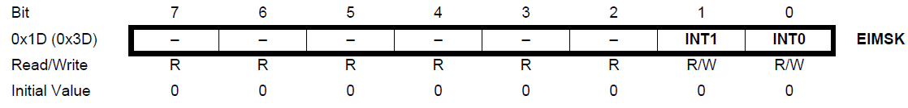
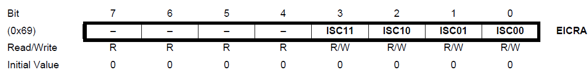
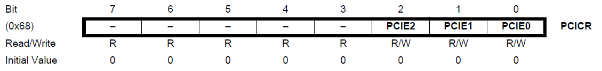
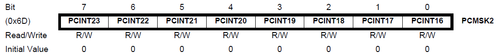
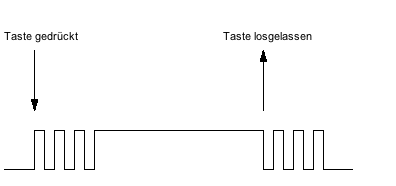

# Interrupts

Ein Interrupt ist ein Signal von Hardware oder Software, das ein Ereignis meldet, das sofortige Aufmerksamkeit erfordert (Taste gedrückt, serieller Empfang, Timer‑Overflow, ADC fertig, ...). Der Prozessor unterbricht den aktuellen Code, sichert den Zustand und führt eine kurze Funktion aus: die Interrupt Service Routine (ISR). Danach setzt er die normale Ausführung fort. Alternativ kann man Flags per Polling abfragen – das hat jedoch den Nachteil, dass man Ereignisse verpassen kann.

Es gibt:
- Hardware‑Interrupts (intern/extern)
- Software‑Interrupts

Interne Interrupts entstehen z. B. bei ADC‑Fertig, Timer‑Überlauf, UART‑Daten; externe Interrupts reagieren auf Pegel/Flanken an Pins.

## Grundprinzip eines Interrupts

Der normale Ablauf eines Mikrocontrollers sieht wie folgt aus:
1. Nächste Instruktion aus dem Programmspeicher laden (in das Befehlsregister)
2. Programmzähler inkrementieren (zeigt immer auf die nächste Instruktion)
3. Instruktion dekodieren
4. Instruktion ausführen (oder bei mehrbytigen Befehlen: überspringen und nächster Fetch ist Teil dieses Befehls)

Um Interrupts zu behandeln, prüft die Steuerlogik (Leitwerk) vor dem Laden des nächsten Bytes aus dem Programmspeicher immer, ob ein Interrupt zwischenzeitlich aufgetreten ist. Falls ja, führt der Mikrocontroller folgende Schritte aus (ähnlich einem Unterfunktionsaufruf). Dies wird Kontextwechsel genannt:

1. Programmzähler wird auf den Stack gepusht (um zu wissen, wo das Programm nach der Interruptbearbeitung fortgesetzt wird)
2. Aktueller Prozessorzustand = alle internen Prozessorregister (wie der Akkumulator) werden auf den Stack gepusht
3. (Bei normalen Funktionen: Parameter sowie lokale Variablen würden ebenfalls auf den Stack gelegt)
4. Controller prüft, welcher Interrupt aufgetreten ist, durch Auswertung der Interrupt-Flags jeder Komponente (bei mehreren Interrupts wird der mit höchster Priorität gewählt)
5. Der entsprechende Interruptvektor zeigt auf die Adresse, an der die Interruptroutine im Programmspeicher liegt. Diese Adresse wird in den Programmzähler geladen
6. Schließlich wird ein Sprungbefehl (Jump zur ISR) ausgeführt
7. Das entsprechende Interrupt-Flag wird zurückgesetzt, um die ISR nur einmal pro Interrupt-Auftreten auszuführen
8. Die ISR wird ausgeführt (auf einem ATmega328p kann dies nicht durch einen anderen Interrupt unterbrochen werden)
9. Nach Beendigung der ISR (return) werden alle lokalen Variablen/Parameter vom Stack entfernt (pop-Befehle)
10. Der vorherige Prozessorzustand wird durch Poppen aller internen Register vom Stack in die Prozessorregister wiederhergestellt
11. Schließlich wird der Programmzähler vom Stack wiederhergestellt (pop-Befehl), um an der unterbrochenen Stelle fortzufahren
12. Um sicherzustellen, dass das Normalprogramm nicht endlos blockiert bleibt, wird mindestens ein Befehl aus z. B. der Hauptroutine nach der Rückkehr von der ISR ausgeführt

Die Kurzfassung: Instruktion laden → PC inkrementieren → dekodieren → ausführen. Vor dem nächsten Fetch prüft die Steuerlogik, ob ein Interrupt aufgetreten ist. Beim Kontextwechsel werden u. a. Programmzähler und Register auf den Stack gesichert, der passende Interruptvektor bestimmt und zur ISR verzweigt. Nach der ISR werden Register und PC wiederhergestellt.

Beispiel für Vektornamen (ATmega328p):

```c
#define INT0_vect         _VECTOR(1)
#define INT1_vect         _VECTOR(2)
#define PCINT0_vect       _VECTOR(3)
#define PCINT1_vect       _VECTOR(4)
#define PCINT2_vect       _VECTOR(5)
#define WDT_vect          _VECTOR(6)
#define TIMER2_COMPA_vect _VECTOR(7)
#define TIMER2_COMPB_vect _VECTOR(8)
#define TIMER2_OVF_vect   _VECTOR(9)
#define TIMER1_CAPT_vect  _VECTOR(10)
#define TIMER1_COMPA_vect _VECTOR(11)
#define TIMER1_COMPB_vect _VECTOR(12)
#define TIMER1_OVF_vect   _VECTOR(13)
#define TIMER0_COMPA_vect _VECTOR(14)
#define TIMER0_COMPB_vect _VECTOR(15)
#define TIMER0_OVF_vect   _VECTOR(16)
#define SPI_STC_vect      _VECTOR(17)
#define USART_RX_vect     _VECTOR(18)
#define USART_UDRE_vect   _VECTOR(19)
#define USART_TX_vect     _VECTOR(20)
#define ADC_vect          _VECTOR(21)
#define EE_READY_vect     _VECTOR(22)
#define ANALOG_COMP_vect  _VECTOR(23)
#define TWI_vect          _VECTOR(24)
#define SPM_READY_vect    _VECTOR(25)
```

ISRs haben keinen Rückgabewert und nehmen nur ihren Vektor als Argument. Datenübergabe erfolgt über (ggf. `volatile`) globale Variablen.

Das Schlüsselwort `volatile` weist den Compiler an, dass eine Variable ihre Werte unerwartet ändern kann, ohne dass der Quellcode dies explizit zeigt. Der Compiler wird dadurch angewiesen, die Variable nicht zu optimieren oder in Registern zu cachen, bei jedem Zugriff den aktuellen Wert aus dem Speicher zu lesen und keine Zugriffe zu eliminieren oder umzuordnen.

## Externe Interrupts: INT0/INT1

INT0/INT1 liegen auf `PD2`/`PD3` und können auf fallende/steigende Flanke oder Low‑Level reagieren. Aktivierung über `EIMSK` und Konfiguration über `EICRA`:




Initialisierung und ISR:

```c
#include <avr/io.h>
#include <avr/interrupt.h>

volatile uint8_t blinking = 0; // globale Zustandsvariable

void initInterrupt0(void)
{
    EIMSK |= (1 << INT0);      // INT0 einschalten
    EICRA |= (1 << ISC00);     // logische Pegeländerung (any change)
    sei();                     // globale Interrupts aktivieren
}

ISR(INT0_vect)
{
    blinking ^= 1;             // Zustand toggeln
}
```

Nutzung in der Hauptschleife: Wenn `blinking == 1`, LED blinken; sonst LED aus.

## Initialisierung und globale Interrupt-Verwaltung

Üblicherweise werden Interrupts in einer dedizierten Funktion (z. B. `void initInterrupt(void)`) initialisiert, wo die Interrupts maskiert und normalerweise global mit dem Befehl `sei()` aktiviert werden, was für „Set Enable Interrupt" steht. Zu beachten ist, dass Interrupts standardmäßig deaktiviert sind!

Das Interrupt-System deaktiviert normalerweise alle anderen Interrupts, wenn ein Interrupt ausgelöst wird. Dies kann auch manuell mit `cli()` (Clear Enable Interrupt) erfolgen.


## Pin‑Change‑Interrupts (PCINT)

Pin‑Change‑Interrupts können auf allen Pins konfiguriert werden und sind port‑weise gruppiert (B, C, D). Aktivierung über `PCICR`, Maskierung der gewünschten Pins über `PCMSKx`. Im ISR muss der betroffene Pin geprüft werden.




Beispiel:

```c
void initPinChangeInterrupt18(void) {
    PCICR  |= (1 << PCIE2);      // Bank D aktivieren
    PCMSK2 |= (1 << PCINT18);    // PD2 (PCINT18) maskieren
    sei();
}

ISR(PCINT2_vect)
{
    if ((PIND & (1 << PD2)) == 0) {
        // PD2 ist Low → Aktion
    }
}
```

Hinweis: Entprellen von Tastern ist erforderlich; sonst toggelt der Zustand mehrfach durch Prellen.


