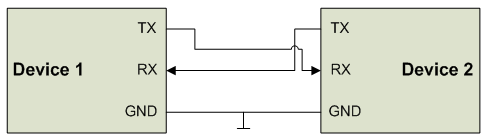
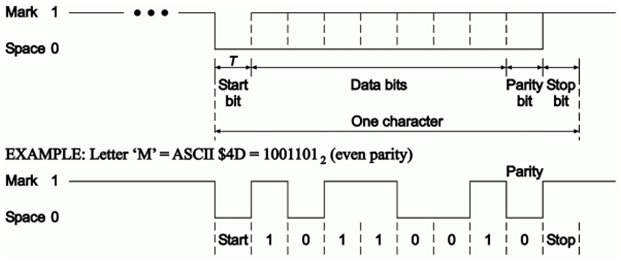
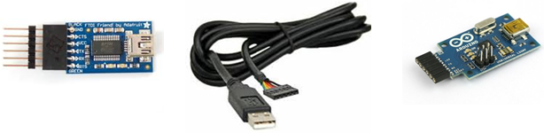
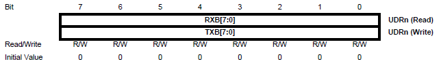
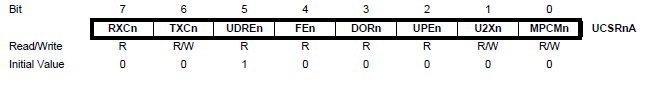
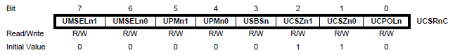
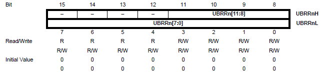

# Serielle Kommunikation

Für die serielle Kommunikation benötigt man minimal:
- TX (Senden)
- RX (Empfangen)
- GND (Masse)



Geräte müssen sich auf Datenformat (ASCII, Start/Stop‑Bits, Parität) und Übertragungsgeschwindigkeit (Baudrate) einigen. Üblicher Rahmen:
- 1 Startbit
- 8 Datenbits (typisch)
- optional Paritätsbit (gerade/ungerade)
- 1 Stopbit



UART (asynchron) arbeitet mit TTL‑Pegel (0 V → 0, 5 V → 1). RS‑232 nutzt negative Logik (−15…−3 V → 1, 3…15 V → 0), daher ist ein Pegelwandler nötig (z. B. MAX232). Für USB: FTDI‑Adapter/Kabel oder kompatible Wandler (Arduino USB2SERIAL).



Viele Controller bieten USART (synchron/asynchron). Wesentliche Register:

- `UDR0`: Datenregister (TX/RX‑Buffer)

- `UCSR0A`: Status/Flags, Double‑Speed

- `UCSR0B`: TX/RX aktivieren, Interrupts

- `UCSR0C`: Modus und Datenformat

- `UBRR0H/L`: Baudraten‑Teiler


## Initialisierung (Beispiel)

```c
#include <avr/io.h>
#include <util/setbaud.h>  // nutzt BAUD‑Definition

void initUART(void) {
    UBRR0H = UBRRH_VALUE;        // High‑Byte (4 MSB)
    UBRR0L = UBRRL_VALUE;        // Low‑Byte (8 LSB)
#if USE_2X
    UCSR0A |= (1 << U2X0);
#else
    UCSR0A &= ~(1 << U2X0);
#endif
    // TX/RX aktivieren
    UCSR0B = (1 << TXEN0) | (1 << RXEN0);
    // Datenformat: 8 Datenbits, 1 Stopbit, keine Parität
    UCSR0C = (1 << UCSZ01) | (1 << UCSZ00);
}
```

Bei interrupt‑getriebener Kommunikation sollten globale Interrupts während der Initialisierung deaktiviert sein; danach gezielt RX/TX‑Interrupts aktivieren.
