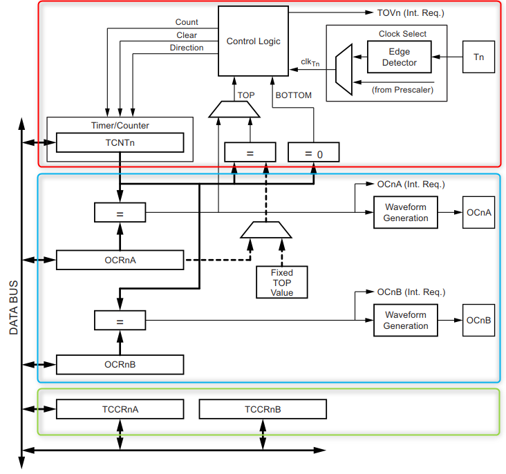
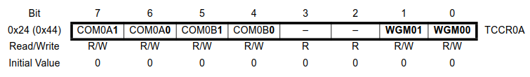
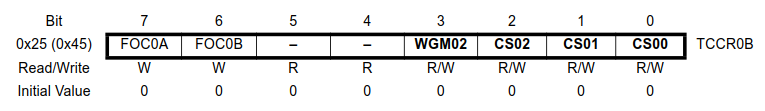
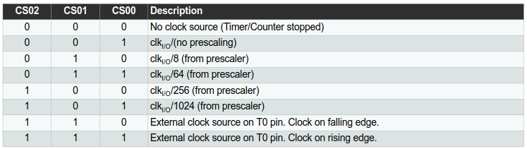
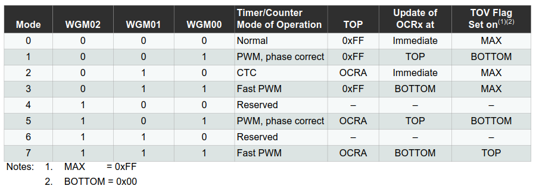
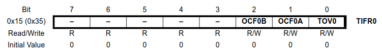
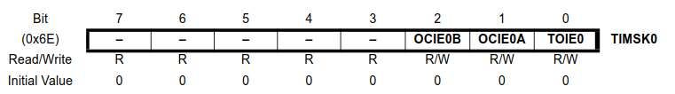

# Timer / Counter

Im „Hello World“‑Beispiel nutzten wir `_delay_ms`, das die CPU blockiert (NOPs). Effizienter ist die Verwendung der Timer/Counter‑Peripherie: Sie zählt interne/externe Flanken und kann Signalformen (z. B. PWM) erzeugen.

Der ATmega328p besitzt drei Timer‑Module: zwei 8‑Bit, einen 16‑Bit. Beim Zugriff auf 16‑Bit‑Werte ist die Lese‑/Schreibrichtung zu beachten (High‑/Low‑Byte‑Puffermechanismus).

## Aufbau von Timer0



Die Konfiguration erfolgt über `TCCR0A` und `TCCR0B`:




## Clock Select

Quellen für den Timer‑Takt:

- Systemtakt
- Systemtakt mit Prescaler (8, 64, 256, 1024)
- Externer Takt an `Tn` (steigende/fallende Flanke)

Beispiel (1 MHz, 8‑Bit‑Timer): größere Prescaler erhöhen die Reichweite, verringern aber die Auflösung.



Hinweis: Ist kein Prescaler‑Bit gesetzt, steht der Timer. Für „kein Prescaler“: `CS00` setzen.

## Betriebsarten

Vier Grundmodi (u. a. Normal, CTC, Fast PWM, Phase‑Correct PWM):



### Normal Mode

Zählt bis `0xFF`, dann Overflow: Flag `TOV0` in `TIFR0` wird gesetzt.



Polling‑Variante (zu schnell fürs Auge):

```c
#include <avr/io.h>
#include "bit_macros.h"

#define LED_DDR  DDRB
#define LED_PORT PORTB
#define LED_PIN  PB5

int main(void)
{
  SET_BIT(LED_DDR, LED_PIN);
  SET_BIT(TCCR0B, CS00);    // Prescaler 1024
  SET_BIT(TCCR0B, CS02);
  TCNT0 = 0;

  while (1) {
    if (GET_BIT(TIFR0, TOV0) == 1) {
      TOGGLE_BIT(LED_PORT, LED_PIN);
      SET_BIT(TIFR0, TOV0); // Flag per 1 zurücksetzen
    }
  }
}
```

Mit Zählen der Overflows (ca. 500 ms):

```c
uint8_t counter = 0;
...
while (1) {
  if (GET_BIT(TIFR0, TOV0) == 1) {
    counter++;
    SET_BIT(TIFR0, TOV0);
  }
  if (counter >= 30) {
    TOGGLE_BIT(LED_PORT, LED_PIN);
    counter = 0;
  }
}
```

Interrupt‑Variante: `TOIE0` in `TIMSK0` setzen; ISR löscht das Flag automatisch.



```c
#include <avr/io.h>
#include <avr/interrupt.h>
#include "bit_macros.h"

#define LED_DDR  DDRB
#define LED_PORT PORTB
#define LED_PIN  PB5

ISR(TIMER0_OVF_vect)
{
  static uint8_t counter;
  counter++;
  if (counter >= 30) {
    TOGGLE_BIT(LED_PORT, LED_PIN);
    counter = 0;
  }
}

int main(void)
{
  SET_BIT(LED_DDR, LED_PIN);
  SET_BIT(TCCR0B, CS00);
  SET_BIT(TCCR0B, CS02);
  SET_BIT(TIMSK0, TOIE0);
  sei();
  while (1) { /* Hauptschleife frei für andere Aufgaben */ }
}
```

Weitere Modi (CTC, Fast PWM, Phase‑Correct PWM) folgen.
