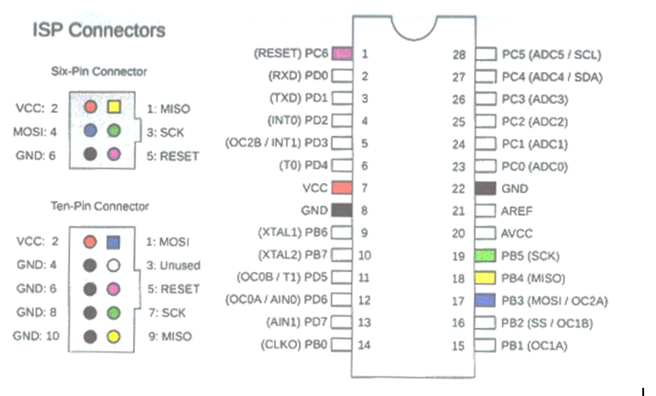
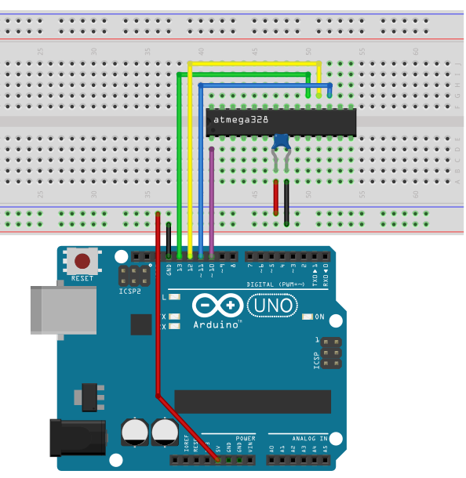
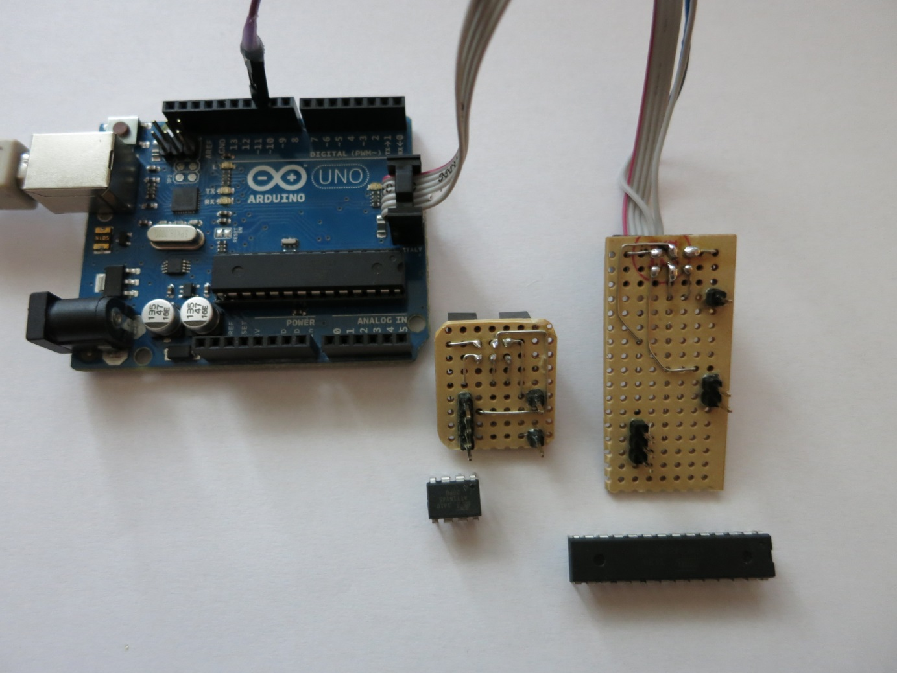
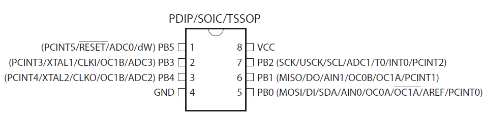
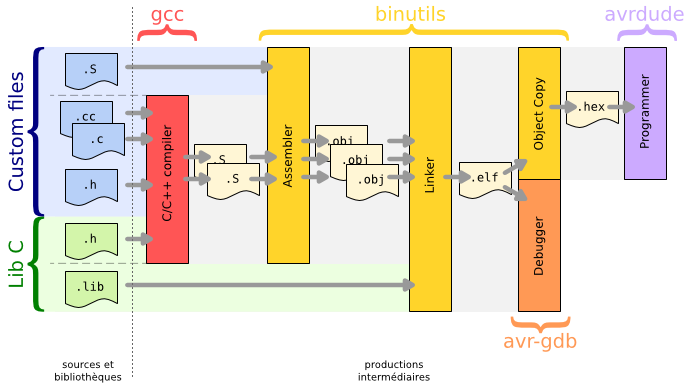

# Anhang A

## ISP‑Einführung

Zum Programmieren benötigen wir einen In‑System‑Programmer (ISP). Da Arduino verbreitet und günstiger ist, kann ein Arduino‑Board als ISP dienen (für AVR‑Controller wie ATmega328p). Es geht auch meistens 

## Arduino‑Board vorbereiten

1. Arduino‑IDE öffnen
2. Board verbinden, passenden Board‑Typ und seriellen Port einstellen
3. Beispiel „ArduinoISP“ laden und hochladen

## Verdrahtung

Programmierung erfolgt typischerweise über SPI. Verdrahtung für ATmega328 mit internem Oszillator:

Für Breadboards: ISP‑Header + 6‑Pin‑Stecker verwenden; Reset mit Pin 10 des Arduino verbinden. Praktisch sind „Programmier‑Krallen" (Prototypen für 28‑Pin ATmega328 und 8‑Pin ATTiny):

## AVR8 GNU Toolchain

Für reine Kommandozeilen‑Nutzung: `avr8‑gnu‑toolchain` und `make` installieren. Eine Toolchain umfasst Compiler/Linker, Assembler, Bibliotheken und den Flash‑Programmer. `make` und ein Makefile steuern die Schritte. Das folgende Bild zeigt die notwendigen Schritte um vom C-File zum Hex-File zu gelangen, welches dann in den Programmspeicher geflasht wird.

Mit Makefile:
- Kompilieren/Linken: `make all`
- Flashen: `make program`

Siehe Beispiel‑Makefile im Projekt: [embedded_systems/4_Arduino_in_C/SourceCodes/Makefile.make](embedded_systems/4_Arduino_in_C/SourceCodes/Makefile.make)

## Visual Studio Code

Mit Visual Studio Code und PlatformIO kann heute in einer zeitgemäßen Entwicklungsumgebung ebenfalls der Arduino in C programmiert werden.
