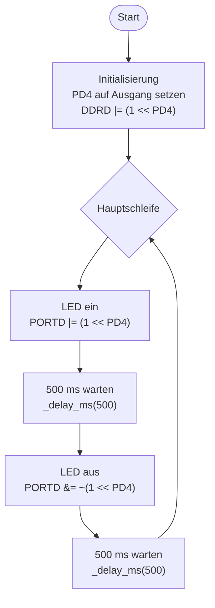

# Lösung: Übung 1 – LED blinken mit DDR/PORT-Registern

## Flussdiagramm



---

## Lösung

```c
#define F_CPU 16000000UL   // Muss VOR util/delay.h definiert sein!
#include <avr/io.h>
#include <util/delay.h>

int main(void) {
    // PD4 als Ausgang: Bit 4 in DDRD setzen
    DDRD |= (1 << PD4);

    while (1) {
        PORTD |=  (1 << PD4);   // LED ein (PD4 = HIGH)
        _delay_ms(500);
        PORTD &= ~(1 << PD4);   // LED aus (PD4 = LOW)
        _delay_ms(500);
    }
    return 0;
}
```

---

## Erklärung

### Initialisierung
`DDRD |= (1 << PD4)` setzt Bit 4 des Data Direction Register D auf 1 → PD4 wird zum Ausgang.
Alle anderen DDRD-Bits bleiben unverändert (OR-Verknüpfung).

### Bit-Operatoren
| Operator | Verwendung | Wirkung |
|----------|-----------|---------|
| `\|= (1 << PD4)` | Bit setzen | Bit auf 1, Rest unverändert |
| `&= ~(1 << PD4)` | Bit löschen | Bit auf 0, Rest unverändert |
| `^= (1 << PD4)` | Bit toggeln | 0→1, 1→0, Rest unverändert |

### Hauptschleife
- `PORTD |= (1 << PD4)` → PD4 auf HIGH → LED leuchtet
- `_delay_ms(500)` → 500 ms Warteschleife (F_CPU wird zur Berechnung gebraucht!)
- `PORTD &= ~(1 << PD4)` → PD4 auf LOW → LED aus

### Besonderheiten
- `F_CPU 16000000UL` muss **vor** `#include <util/delay.h>` definiert sein, sonst berechnet `_delay_ms()` falsche Wartezeiten
- `(1 << PD4)` entspricht `0b00010000` = 16 (dezimal)
- Kein `pinMode()`, kein `digitalWrite()` → direkter Hardware-Zugriff!
