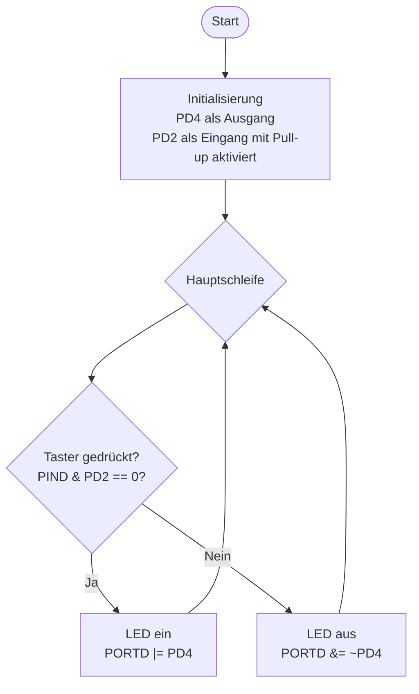

# Lösung: Übung 2 – Taster mit Pull-up lesen (Polling)

## Flussdiagramm



---

## Lösung

```c
#define F_CPU 16000000UL
#include <avr/io.h>

int main(void) {
    // PD4: Ausgang (LED)
    DDRD |= (1 << PD4);

    // PD2: Eingang (Taster) – Bit auf 0
    DDRD &= ~(1 << PD2);

    // Internen Pull-up aktivieren: bei DDR=0, PORTD=1 → Pull-up ~50 kΩ
    PORTD |= (1 << PD2);

    while (1) {
        if (!(PIND & (1 << PD2))) {
            PORTD |=  (1 << PD4);   // Gedrückt → LED ein
        } else {
            PORTD &= ~(1 << PD4);   // Losgelassen → LED aus
        }
    }
    return 0;
}
```

---

## Erklärung

### Initialisierung

**PD2 als Eingang + Pull-up:**
```
DDRD  &= ~(1 << PD2)   → Bit auf 0 = Eingang
PORTD |=  (1 << PD2)   → bei DDR=0: internen Pull-up aktivieren
```
Der interne Pull-up hält PD2 auf HIGH (5V) solange der Taster nicht gedrückt ist.

### Active-low Logik
| Tasterzustand | PD2-Pegel | PIND & (1<<PD2) | !(PIND & ...) |
|---------------|-----------|-----------------|---------------|
| Losgelassen   | HIGH (5V) | ≠ 0             | 0 (falsch)    |
| Gedrückt      | LOW (0V)  | = 0             | 1 (wahr)      |

Das `!` (logisches NICHT) kehrt die Logik um → `if (!(PIND & (1<<PD2)))` bedeutet: **"wenn Taster gedrückt"**.

### Register-Unterschiede
| Register | Funktion | Lesen/Schreiben |
|----------|----------|-----------------|
| `DDRD`   | Richtung (0=Eingang, 1=Ausgang) | Schreiben |
| `PORTD`  | Ausgang setzen / Pull-up bei Eingang | Schreiben |
| `PIND`   | Aktuellen physischen Pin-Zustand lesen | Lesen |

### Besonderheiten
- Kein `_delay_ms()` nötig (Polling ist schnell genug für direkte LED-Steuerung)
- Prellen ist bei diesem einfachen Beispiel sichtbar, stört aber bei direkter LED-Steuerung kaum
