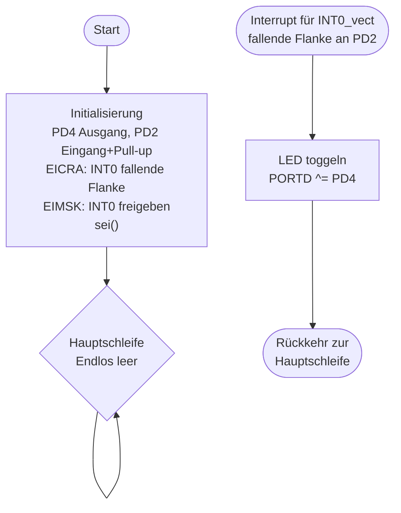

# Lösung: Übung 3 – Externe Interrupts mit INT0

## Flussdiagramm



---

## Lösung

```c
#define F_CPU 16000000UL
#include <avr/io.h>
#include <avr/interrupt.h>

ISR(INT0_vect) {
    PORTD ^= (1 << PD4);    // LED toggeln
}

int main(void) {
    // GPIO
    DDRD |=  (1 << PD4);    // PD4: Ausgang (LED)
    DDRD &= ~(1 << PD2);    // PD2: Eingang
    PORTD |=  (1 << PD2);   // Pull-up aktivieren

    // INT0: fallende Flanke (ISC01=1, ISC00=0)
    EICRA |=  (1 << ISC01);
    EICRA &= ~(1 << ISC00);

    // INT0 freigeben
    EIMSK |= (1 << INT0);

    // Globale Interrupts freigeben
    sei();

    while (1) { }   // Hauptschleife leer
    return 0;
}
```

---

## Erklärung

### Initialisierung: Interrupt-Register

**EICRA – External Interrupt Control Register A:**
```
EICRA |= (1 << ISC01);    // ISC01 = 1
EICRA &= ~(1 << ISC00);   // ISC00 = 0
→ Fallende Flanke: HIGH → LOW
```

**EIMSK – External Interrupt Mask Register:**
```
EIMSK |= (1 << INT0);   // INT0 freigeben
```

**sei():**  Setzt das globale Interrupt-Enable-Bit (I-Bit im SREG).
Ohne `sei()` werden keine Interrupts ausgeführt, egal was in EIMSK steht.

### ISR

```c
ISR(INT0_vect) {
    PORTD ^= (1 << PD4);
}
```
- `ISR(INT0_vect)` ist der Vektor-Name für INT0 (festgelegt vom ATmega328P)
- Wird von der Hardware aufgerufen wenn INT0 feuert
- `^=` toggelt das Bit: 0→1 oder 1→0

### Besonderheiten: Prellen sichtbar
Ohne Entprellung kann ein Tasterdruck viele Interrupts auslösen.
Die LED scheint zufällig zu reagieren — das ist normales Kontaktprellen (~1-10 ms).
**Lösung: Flag-Pattern in Übung 4!**

### Programmablauf
```
Hauptschleife läuft → Tasterdruck → Interrupt-Controller erkennt Flanke
→ Aktuelle Instruktion beenden → Kontext sichern → ISR ausführen
→ Kontext wiederherstellen → Hauptschleife weiter
```
