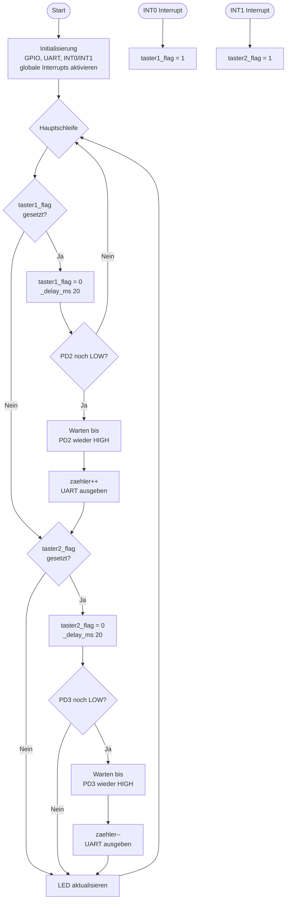

# Lösung: Übung 4 – Software-Entprellung mit Flag-Pattern

## Flussdiagramm



---

## Lösung

```c
#define F_CPU 16000000UL
#include <avr/io.h>
#include <avr/interrupt.h>
#include <util/delay.h>

volatile uint8_t taster1_flag = 0;
volatile uint8_t taster2_flag = 0;
uint8_t zaehler = 0;

/* UART-Hilfsfunktionen */
void uart_init(void) {
    UBRR0L = 103;  // 9600 Baud @ 16 MHz
    UCSR0B = (1 << TXEN0);
    UCSR0C = (1 << UCSZ01) | (1 << UCSZ00);
}

void uart_putc(char c) {
    while (!(UCSR0A & (1 << UDRE0)));
    UDR0 = c;
}

void uart_puts(const char *s) {
    while (*s) uart_putc(*s++);
}

void uart_put_uint8(uint8_t v) {
    if (v >= 100) uart_putc('0' + v/100);
    if (v >= 10)  uart_putc('0' + (v/10)%10);
    uart_putc('0' + v%10);
}

ISR(INT0_vect) { 
    taster1_flag = 1;
}

ISR(INT1_vect) {
    taster2_flag = 1;
}

uint8_t debounce(volatile uint8_t *flag, uint8_t pin) {
    *flag = 0;
    _delay_ms(20);
    if (!(PIND & (1 << pin))) {
        while (!(PIND & (1 << pin)));
        return 1;
    }
    return 0;
}

int main(void) {
    DDRD |=  (1 << PD4);
    DDRD &= ~((1 << PD2) | (1 << PD3));
    PORTD |=  (1 << PD2) | (1 << PD3);

    uart_init();

    EICRA |=  (1 << ISC01); EICRA &= ~(1 << ISC00);  // INT0 fallende Flanke
    EICRA |=  (1 << ISC11); EICRA &= ~(1 << ISC10);  // INT1 fallende Flanke
    EIMSK |= (1 << INT0) | (1 << INT1);
    sei();

    uart_puts("Zaehler: 0\n");

    while (1) {
        if (taster1_flag) {
            if (debounce(&taster1_flag, PD2)) {
                if (zaehler < 255) zaehler++;
                uart_puts("Zaehler: "); uart_put_uint8(zaehler); uart_puts("\n");
            }
        }
        if (taster2_flag) {
            if (debounce(&taster2_flag, PD3)) {
                if (zaehler > 0) zaehler--;
                uart_puts("Zaehler: "); uart_put_uint8(zaehler); uart_puts("\n");
            }
        }
        if (zaehler > 0) PORTD |=  (1 << PD4);
        else             PORTD &= ~(1 << PD4);
    }
    return 0;
}
```

---

## Erklärung

### Das Flag-Pattern

```
ISR:            Hauptschleife:
  flag = 1;  →    if (flag) {
                      flag = 0;
                      _delay_ms(20);       // Prellzeit abwarten
                      if (Pin noch LOW?)   // Echter Tasterdruck?
                          Loslassen abwarten
                          Verarbeiten
                      }
                  }
```

**Warum so?**
- ISR darf nicht blockieren → kein `_delay_ms` in der ISR
- 20 ms überbrückt das Prellen (mechanische Kontakte)
- Warten auf Loslassen verhindert mehrfaches Auslösen

### volatile
Ohne `volatile`: Compiler optimiert den Lesezugriff auf `flag` in der Hauptschleife weg
(sieht im Code keine Änderung → liest immer aus Register statt RAM).
Mit `volatile`: Immer frisch aus dem Speicher lesen → ISR-Änderungen sichtbar.

### UART-Berechnung
```
UBRR = F_CPU / (16 × BAUD) - 1
     = 16.000.000 / (16 × 9600) - 1
     = 104,17 - 1
     ≈ 103
```
