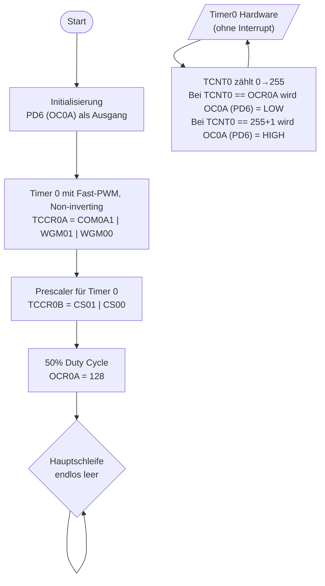

# Lösung: Übung 5 – Timer0 Fast-PWM konfigurieren

## Flussdiagramm



---

## Lösung

```c
#define F_CPU 16000000UL
#include <avr/io.h>

int main(void) {
    // PD6 als Ausgang (OC0A muss Ausgang sein!)
    DDRD |= (1 << PD6);

    // Timer0 Fast-PWM, Non-inverting auf OC0A, Prescaler 64
    // f_PWM = 16.000.000 / (64 × 256) = 976,6 Hz
    TCCR0A = (1 << COM0A1) | (1 << WGM01) | (1 << WGM00);
    TCCR0B = (1 << CS01) | (1 << CS00);

    OCR0A = 128;   // ~50% Duty Cycle

    while (1) { }  // Timer läuft automatisch
    return 0;
}
```

---

## Erklärung

### Pflichtberechnung: PWM-Frequenz

```
f_PWM = F_CPU / (Prescaler × 256)
      = 16.000.000 / (64 × 256)
      = 16.000.000 / 16.384
      = 976,6 Hz
```
> Kein Flimmern sichtbar (deutlich über 50 Hz Wahrnehmungsgrenze).

### TCCR0A – Bit-Konfiguration

| Bit | Wert | Bedeutung |
|-----|------|-----------|
| COM0A1=1, COM0A0=0 | Non-inverting | OC0A LOW wenn TCNT0==OCR0A |
| WGM01=1, WGM00=1 | Fast-PWM Mode | TOP = 0xFF (255) |

### TCCR0B – Prescaler

| CS02 | CS01 | CS00 | Prescaler |
|------|------|------|-----------|
| 0 | 1 | 1 | **64** ← unsere Wahl |

### Fast-PWM Signalform (Non-inverting)
```
PD6:  ___________           ___________
     |           |         |           |
     |           |_________|           |________
     ↑           ↑
    TCNT0=0    TCNT0=OCR0A

←---- 1 Periode ≈ 1/976,6 Hz ≈ 1,024 ms ----→
←- HIGH -→←------- LOW --------→
  OCR0A        256-OCR0A
```

### OCR0A-Werte und Helligkeiten
| OCR0A | Duty Cycle | Helligkeit |
|-------|-----------|-----------|
| 0     | 0 %       | aus       |
| 64    | 25 %      | schwach   |
| 128   | 50 %      | mittel    |
| 191   | 75 %      | hell      |
| 255   | 100 %     | max       |

### Besonderheiten
- `DDRD |= (1 << PD6)` ist Pflicht! Ohne Ausgang-Konfiguration gibt der Timer kein Signal aus.
- OCR0A kann jederzeit geändert werden — Timer läuft weiter, Duty Cycle aktualisiert sich sofort.
