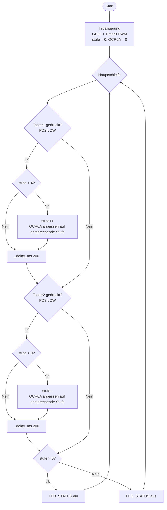

# Lösung: Übung 6 – 5-stufige Helligkeitssteuerung (Polling)

## Flussdiagramm



---

## Lösung

```c
#define F_CPU 16000000UL
#include <avr/io.h>
#include <util/delay.h>

int main(void) {
    uint8_t stufen[5] = {0, 64, 128, 191, 255};
    uint8_t stufe = 0;

    // GPIO
    DDRD &= ~((1 << PD2) | (1 << PD3));   // Eingang
    PORTD |=  (1 << PD2) | (1 << PD3);   // Pull-up
    DDRD |= (1 << PD4) | (1 << PD6);     // Ausgänge

    // Timer0 Fast-PWM
    // f_PWM = 16.000.000 / (64 × 256) = 976,6 Hz
    TCCR0A = (1 << COM0A1) | (1 << WGM01) | (1 << WGM00);
    TCCR0B = (1 << CS01) | (1 << CS00);
    OCR0A  = stufen[stufe];

    while (1) {
        if (!(PIND & (1 << PD2))) {
            if (stufe < 4) { stufe++; OCR0A = stufen[stufe]; }
            _delay_ms(200);
        }
        if (!(PIND & (1 << PD3))) {
            if (stufe > 0) { stufe--; OCR0A = stufen[stufe]; }
            _delay_ms(200);
        }
        if (stufe > 0) PORTD |=  (1 << PD4);
        else           PORTD &= ~(1 << PD4);
    }
    return 0;
}
```

---

## Erklärung

### Stufen-Array
```c
uint8_t stufen[5] = {0, 64, 128, 191, 255};
//                   ↑   ↑    ↑    ↑    ↑
//                  0%  25%  50%  75% 100%
```
Index `stufe` (0–4) zeigt auf den aktuellen OCR0A-Wert.

### Begrenzung
```c
if (stufe < 4) stufe++;   // Nicht über Index 4 (= 100%)
if (stufe > 0) stufe--;   // Nicht unter Index 0 (= 0%)
```

### OCR0A sofort aktualisieren
```c
OCR0A = stufen[stufe];
```
Der Timer übernimmt den neuen Wert beim nächsten PWM-Zyklus (< 1,1 ms Verzögerung bei 976 Hz).

### Grüne LED Logik
```
stufe == 0  →  0% Helligkeit  →  LED_STATUS aus (System "inaktiv")
stufe >= 1  →  Helligkeit an  →  LED_STATUS ein (System "aktiv")
```

### Besonderheiten: _delay_ms(200) als Entprellung
- Einfach aber blockierend: 200 ms lang reagiert das Programm auf nichts anderes
- Praxistauglich für 1-Taster-System, problematisch bei mehreren Ereignissen