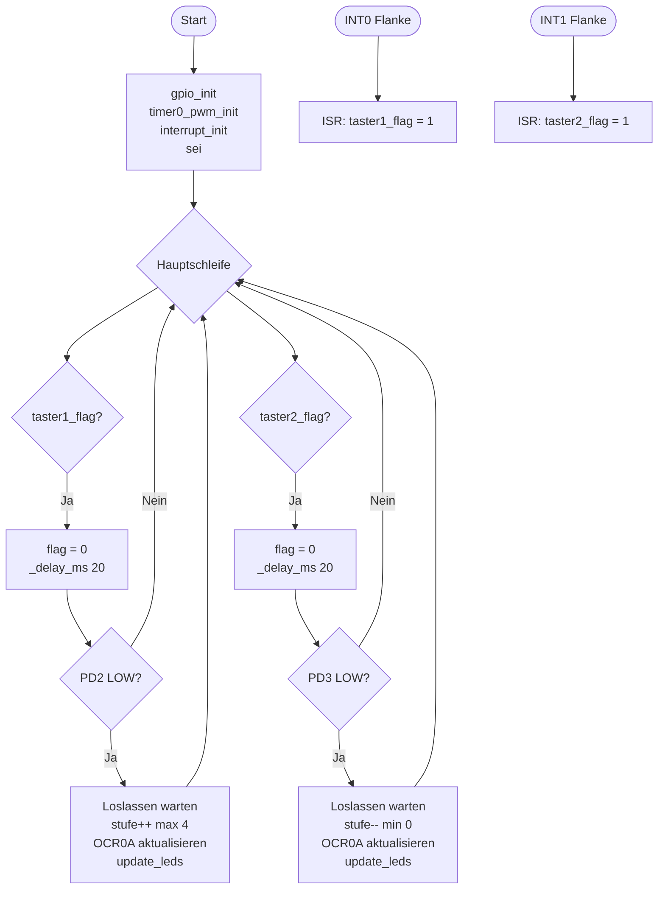

# Lösung: Übung 7 – Interrupts + Entprellung + PWM kombiniert

## Flussdiagramm



---

## Lösung

```c
#define F_CPU 16000000UL
#include <avr/io.h>
#include <avr/interrupt.h>
#include <util/delay.h>

volatile uint8_t taster1_flag = 0;
volatile uint8_t taster2_flag = 0;
uint8_t stufen[5] = {0, 64, 128, 191, 255};
uint8_t stufe = 0;

ISR(INT0_vect) { taster1_flag = 1; }
ISR(INT1_vect) { taster2_flag = 1; }

void gpio_init(void) {
    DDRD &= ~((1 << PD2) | (1 << PD3));
    PORTD |=  (1 << PD2) | (1 << PD3);
    DDRD |= (1 << PD4) | (1 << PD6);
}

void timer0_pwm_init(void) {
    // f_PWM = 16.000.000 / (64 × 256) = 976,6 Hz
    TCCR0A = (1 << COM0A1) | (1 << WGM01) | (1 << WGM00);
    TCCR0B = (1 << CS01) | (1 << CS00);
    OCR0A  = stufen[stufe];
}

void interrupt_init(void) {
    EICRA |= (1 << ISC01); EICRA &= ~(1 << ISC00);   // INT0 fallende Flanke
    EICRA |= (1 << ISC11); EICRA &= ~(1 << ISC10);   // INT1 fallende Flanke
    EIMSK |= (1 << INT0) | (1 << INT1);
}

void update_leds(void) {
    if (stufe > 0) PORTD |=  (1 << PD4);
    else           PORTD &= ~(1 << PD4);
}

uint8_t debounce_pind(uint8_t pin) {
    _delay_ms(20);
    if (!(PIND & (1 << pin))) {
        while (!(PIND & (1 << pin)));
        return 1;
    }
    return 0;
}

int main(void) {
    gpio_init();
    timer0_pwm_init();
    interrupt_init();
    sei();

    while (1) {
        if (taster1_flag) {
            taster1_flag = 0;
            if (debounce_pind(PD2)) {
                if (stufe < 4) { stufe++; OCR0A = stufen[stufe]; }
                update_leds();
            }
        }
        if (taster2_flag) {
            taster2_flag = 0;
            if (debounce_pind(PD3)) {
                if (stufe > 0) { stufe--; OCR0A = stufen[stufe]; }
                update_leds();
            }
        }
    }
    return 0;
}
```

---

## Erklärung

### Gesamtarchitektur

```
Hardware-Ebene:     Taster → Flanke → Interrupt-Controller → ISR
ISR:                setzt nur flag (1 Instruktion!)
Hauptschleife:      prüft flag → entprellt → verarbeitet → LED aktualisiert
Timer0:             läuft parallel, generiert PWM autonom
```

### INT1-Konfiguration (neu in Übung7)
INT1 verwendet **ISC11 und ISC10** (Bits 3 und 2 in EICRA):
```c
EICRA |=  (1 << ISC11);   // Bit 3
EICRA &= ~(1 << ISC10);   // Bit 2
// → fallende Flanke auf INT1 (PD3)
```

### Initialisierungsfunktionen
Strukturierter Code durch separate `init`-Funktionen → besser lesbar, wartbar.
Separate Initialisierungsfunktionen gestatten eine kürzere `main()` → klarer, weniger Fehler.

### Besonderheiten
- `taster1_flag = 0` **vor** `_delay_ms(20)`: verhindert, dass während der Wartezeit
  ein neuer ISR-Aufruf das Flag neu setzt und sofort verarbeitet wird
- `update_leds()` nur bei Stufenänderung aufrufen – nicht in jeder Iteration
