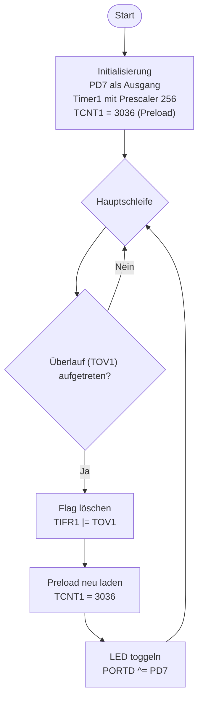

# Lösung: Übung 8 – Timer1: Sekundentakt per Overflow-Polling

## Flussdiagramm



---

## Lösung

```c
#define F_CPU 16000000UL
#include <avr/io.h>

int main(void) {
    DDRD |= (1 << PD7);   // PD7: Ausgang (LED_ROT)

    // Timer1: Normal-Mode, Prescaler 256
    // f_Timer = 16.000.000 / 256 = 62.500 Hz
    // Preload = 65.536 - 62.500 = 3.036 → 1-Sekunden-Überlauf
    TCCR1B = (1 << CS12);
    TCNT1  = 3036;

    while (1) {
        if (TIFR1 & (1 << TOV1)) {
            TIFR1 |= (1 << TOV1);   // TOV1 löschen (1 schreiben!)
            TCNT1 = 3036;            // Preload neu laden
            PORTD ^= (1 << PD7);    // LED toggeln
        }
    }
    return 0;
}
```

---

## Erklärung

### Pflichtberechnung

```
Schritt 1: Timer-Taktfrequenz nach Prescaler
  f_Timer = F_CPU / Prescaler
  f_Timer = 16.000.000 / 256 = 62.500 Hz

Schritt 2: Gewünschte Periode = 1 Sekunde
  Ticks für 1 s = 62.500

Schritt 3: Timer1 ist 16-Bit (0 bis 65.535)
  Preload = 65.536 - 62.500 = 3.036

→ TCNT1 = 3036 → Timer läuft 62.500 Ticks → Überlauf → 1 Sekunde
```

### TOV1-Flag: Wichtige Besonderheit!

```c
// RICHTIG: durch Schreiben einer 1 löschen
TIFR1 |= (1 << TOV1);   ✓

// FALSCH: durch Schreiben einer 0 löschen (ändert nichts!)
TIFR1 &= ~(1 << TOV1);  ✗
```

Hintergrund: Status-Flags im ATmega werden durch **"Write 1 to Clear"** gelöscht.
Das ist eine häufige Fehlerquelle!

### Prescaler-Tabelle Timer1

| CS12 | CS11 | CS10 | Prescaler |
|------|------|------|-----------|
| 0 | 0 | 1 | 1 |
| 0 | 1 | 0 | 8 |
| 0 | 1 | 1 | 64 |
| 1 | 0 | 0 | **256** ← wir wollen das |
| 1 | 0 | 1 | 1024 |

### TCNT1 neu laden
Ohne Neuladen: Nach Überlauf startet TCNT1 bei 0 → nächster Überlauf nach 65.536 Ticks ≈ 1,049 s.
Mit Neuladen 3036: Jede Periode exakt 1,000 s. Kein Drift!

### Besonderheiten
- Normal-Mode: keine WGM-Bits gesetzt (Standard nach Reset) → Timer zählt einfach hoch
- TCNT1 ist 16-Bit → direkter Zugriff wie bei uint16_t möglich
