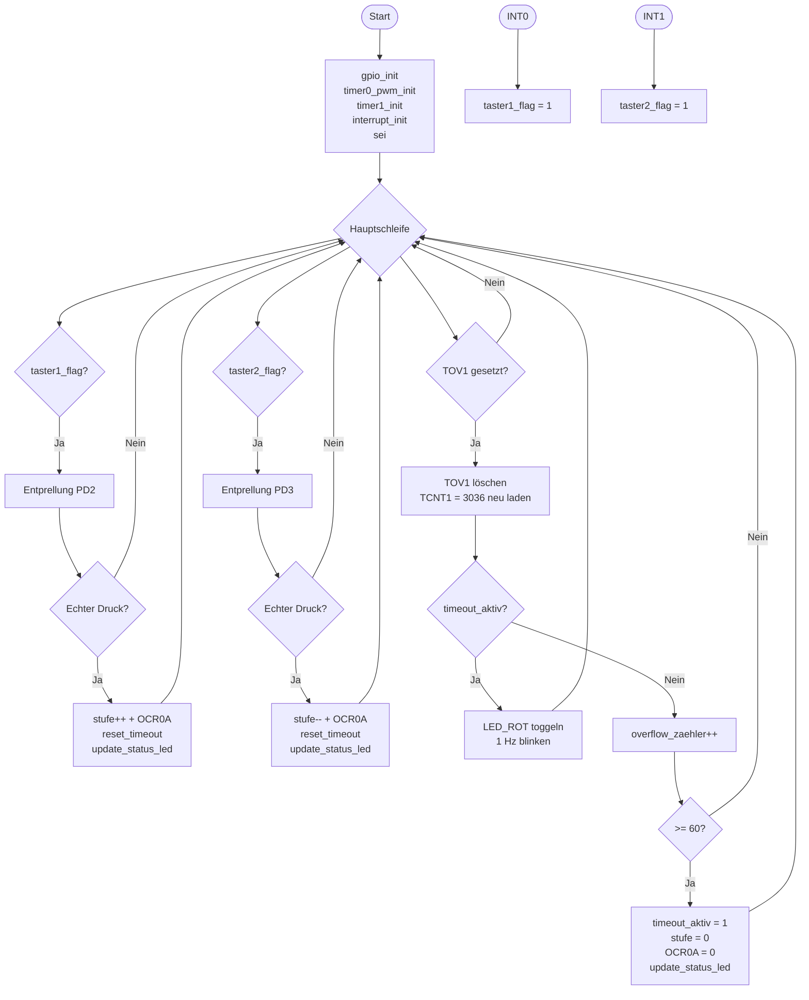

# Lösung: Übung 9 – Inaktivitäts-Timeout nach 60 Sekunden

## Flussdiagramm



---

## Lösung

```c
#define F_CPU 16000000UL
#include <avr/io.h>
#include <avr/interrupt.h>
#include <util/delay.h>

volatile uint8_t taster1_flag    = 0;
volatile uint8_t taster2_flag    = 0;
volatile uint8_t overflow_zaehler = 0;
volatile uint8_t timeout_aktiv   = 0;
uint8_t stufen[5] = {0, 64, 128, 191, 255};
uint8_t stufe     = 0;

ISR(INT0_vect) { taster1_flag = 1; }
ISR(INT1_vect) { taster2_flag = 1; }

void gpio_init(void) {
    DDRD &= ~((1 << PD2) | (1 << PD3));
    PORTD |=  (1 << PD2) | (1 << PD3);
    DDRD  |=  (1 << PD4) | (1 << PD6) | (1 << PD7);
}

void timer0_pwm_init(void) {
    // f_PWM = 16.000.000 / (64 × 256) = 976,6 Hz
    TCCR0A = (1 << COM0A1) | (1 << WGM01) | (1 << WGM00);
    TCCR0B = (1 << CS01) | (1 << CS00);
    OCR0A  = stufen[stufe];
}

void timer1_init(void) {
    // Prescaler 256, Preload 3036 → 1 s Überlauf
    // f_Timer = 16.000.000 / 256 = 62.500 Hz
    // Preload = 65.536 - 62.500 = 3.036
    TCCR1B = (1 << CS12);
    TCNT1  = 3036;
}

void interrupt_init(void) {
    EICRA |= (1 << ISC01); EICRA &= ~(1 << ISC00);
    EICRA |= (1 << ISC11); EICRA &= ~(1 << ISC10);
    EIMSK |= (1 << INT0) | (1 << INT1);
}

void update_status_led(void) {
    if (stufe > 0 && !timeout_aktiv) PORTD |=  (1 << PD4);
    else                              PORTD &= ~(1 << PD4);
}

uint8_t debounce_pind(uint8_t pin) {
    _delay_ms(20);
    if (!(PIND & (1 << pin))) { while (!(PIND & (1 << pin))); return 1; }
    return 0;
}

void reset_timeout(void) {
    overflow_zaehler = 0;
    TCNT1 = 3036;
    timeout_aktiv = 0;
    PORTD &= ~(1 << PD7);   // LED_ROT aus
}

int main(void) {
    gpio_init(); timer0_pwm_init(); timer1_init(); interrupt_init(); sei();

    while (1) {
        if (taster1_flag) {
            taster1_flag = 0;
            if (debounce_pind(PD2)) {
                if (stufe < 4) { stufe++; OCR0A = stufen[stufe]; }
                reset_timeout(); update_status_led();
            }
        }
        if (taster2_flag) {
            taster2_flag = 0;
            if (debounce_pind(PD3)) {
                if (stufe > 0) { stufe--; OCR0A = stufen[stufe]; }
                reset_timeout(); update_status_led();
            }
        }
        if (TIFR1 & (1 << TOV1)) {
            TIFR1 |= (1 << TOV1);
            TCNT1 = 3036;
            if (timeout_aktiv) {
                PORTD ^= (1 << PD7);   // LED_ROT toggeln → 1 Hz
            } else {
                overflow_zaehler++;
                if (overflow_zaehler >= 0) {
                    timeout_aktiv = 1;
                    stufe = 0; OCR0A = stufen[stufe];
                    update_status_led();
                }
            }
        }
    }
    return 0;
}
```

---

## Erklärung

### Zusammenspiel der Komponenten

```
Timer0 (PWM):     läuft autonom, OCR0A bestimmt Helligkeit
Timer1 (Timeout): läuft parallel, TOV1 alle 1 Sekunde
INT0/INT1:        Taster → Flag → Entprellung → Stufenänderung + Reset
Timeout-Logik:    overflow_zaehler >= 60 → LED aus, rot blinkt
```

### reset_timeout()
```c
void reset_timeout(void) {
    overflow_zaehler = 0;   // Zähler auf 0 → neue 60s starten
    TCNT1 = 3036;           // Timer neu laden → volle Sekunde bis nächster Tick
    timeout_aktiv = 0;      // Timeout deaktivieren
    PORTD &= ~(1 << PD7);  // LED_ROT sofort ausschalten
}
```
**TCNT1 neu laden ist wichtig:** Ohne Neuladen könnte der Timer kurz vor dem nächsten Überlauf sein → erster Zähler nach Reset feuert fast sofort.

### Rote LED: nur bei Timeout!
```c
if (timeout_aktiv) {
    PORTD ^= (1 << PD7);   // Toggelt jede Sekunde → 1 Hz
}
```
Im Normalbetrieb (timeout_aktiv == 0) wird PD7 nie angefasst → bleibt aus.

### Konzeptübersicht: Alle Themen abgedeckt
| Teilaufgabe | Thema | Implementiert |
|-------------|-------|---------------|
| 1.1 | Port-Konfig, Pull-ups, INT0/INT1, Entprellung, Status-LED | ✓ |
| 1.2 | Timer0 Fast-PWM, Freq-Berechnung, 5 Stufen, OCR0A | ✓ |
| 1.3 | Timer1 Normal-Mode, 60-sec Timeout, rote LED blinkt | ✓ |
