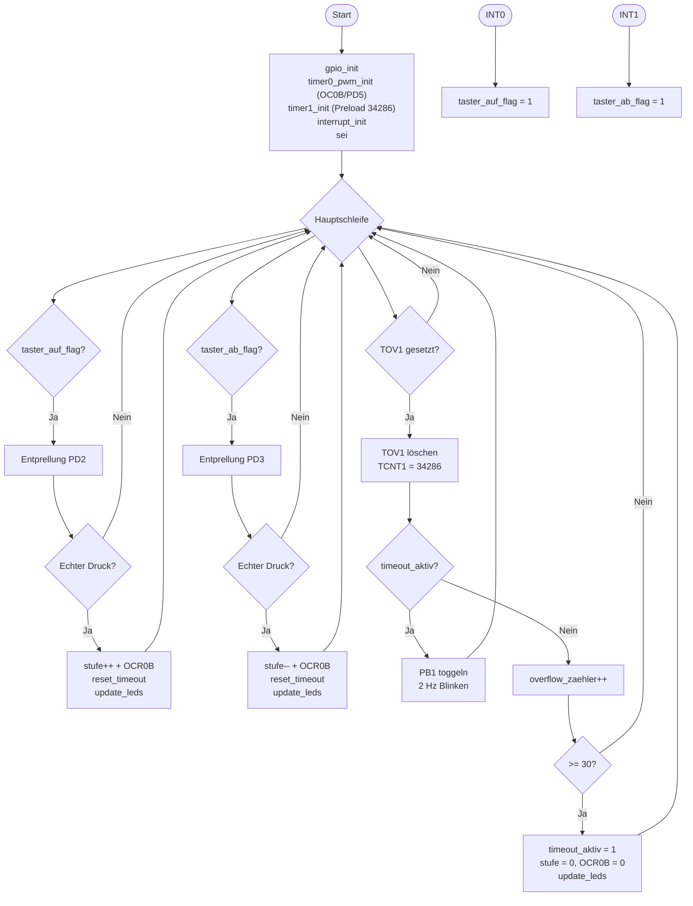

# Lösung: Übung 10 – Lüftergeschwindigkeits-Steuerung

## Flussdiagramm



---

## Lösung

```c
/*
 * Übung 10 – Lüftersteuerung
 * Pinbelegung: PD2/PD3 Taster, PB0 LED_BETRIEB, PD5 LUEFTER (OC0B), PB1 LED_WARNUNG
 *
 * Berechnungen:
 * f_PWM  = 16.000.000 / (64 × 256) = 976,6 Hz
 * f_Timer = 16.000.000 / 256 = 62.500 Hz
 * Preload = 65.536 - 31.250 = 34.286 → 0,5-s-Überlauf
 * Timeout = 30 × 0,5 s = 15 Sekunden
 */
#define F_CPU 16000000UL
#include <avr/io.h>
#include <avr/interrupt.h>
#include <util/delay.h>

volatile uint8_t taster_auf_flag  = 0;
volatile uint8_t taster_ab_flag   = 0;
volatile uint8_t overflow_zaehler = 0;
volatile uint8_t timeout_aktiv    = 0;
uint8_t stufen[5] = {0, 64, 128, 191, 255};
uint8_t stufe     = 0;

ISR(INT0_vect) { taster_auf_flag = 1; }
ISR(INT1_vect) { taster_ab_flag  = 1; }

void gpio_init(void) {
    DDRD &= ~((1 << PD2) | (1 << PD3));  // Eingänge
    PORTD |=  (1 << PD2) | (1 << PD3);   // Pull-up
    DDRD |=  (1 << PD5);                  // PD5: OC0B Ausgang
    DDRB |= (1 << PB0) | (1 << PB1);     // PB0, PB1: Ausgänge (DDRB!)
}

void timer0_pwm_init(void) {
    // Fast-PWM auf OC0B (PD5): COM0B1 statt COM0A1!
    // f_PWM = 16.000.000 / (64 × 256) = 976,6 Hz
    TCCR0A = (1 << COM0B1) | (1 << WGM01) | (1 << WGM00);
    TCCR0B = (1 << CS01) | (1 << CS00);
    OCR0B  = stufen[stufe];  // OCR0B statt OCR0A!
}

void timer1_init(void) {
    // Prescaler 256, Preload 34286 → 0,5-s-Überlauf
    // Preload = 65.536 - 31.250 = 34.286
    TCCR1B = (1 << CS12);
    TCNT1  = 34286;
}

void interrupt_init(void) {
    EICRA |= (1 << ISC01); EICRA &= ~(1 << ISC00);
    EICRA |= (1 << ISC11); EICRA &= ~(1 << ISC10);
    EIMSK |= (1 << INT0) | (1 << INT1);
}

void update_leds(void) {
    if (stufe > 0 && !timeout_aktiv) PORTB |=  (1 << PB0);  // PB0!
    else                              PORTB &= ~(1 << PB0);
}

uint8_t debounce_pind(uint8_t pin) {
    _delay_ms(20);
    if (!(PIND & (1 << pin))) { while (!(PIND & (1 << pin))); return 1; }
    return 0;
}

void reset_timeout(void) {
    overflow_zaehler = 0;
    TCNT1 = 34286;           // 0,5-s-Preload neu laden!
    timeout_aktiv = 0;
    PORTB &= ~(1 << PB1);   // LED_WARNUNG aus (PB1!)
}

int main(void) {
    gpio_init(); timer0_pwm_init(); timer1_init(); interrupt_init(); sei();

    while (1) {
        if (taster_auf_flag) {
            taster_auf_flag = 0;
            if (debounce_pind(PD2)) {
                if (stufe < 4) { stufe++; OCR0B = stufen[stufe]; }
                reset_timeout(); update_leds();
            }
        }
        if (taster_ab_flag) {
            taster_ab_flag = 0;
            if (debounce_pind(PD3)) {
                if (stufe > 0) { stufe--; OCR0B = stufen[stufe]; }
                reset_timeout(); update_leds();
            }
        }
        if (TIFR1 & (1 << TOV1)) {
            TIFR1 |= (1 << TOV1);
            TCNT1 = 34286;   // 0,5-s-Preload!
            if (timeout_aktiv) {
                PORTB ^= (1 << PB1);   // LED_WARNUNG toggeln (PB1!) → 2 Hz
            } else {
                overflow_zaehler++;
                if (overflow_zaehler >= 30) {  // 30 × 0,5 s = 15 s
                    timeout_aktiv = 1;
                    stufe = 0; OCR0B = stufen[stufe];
                    update_leds();
                }
            }
        }
    }
    return 0;
}
```

---

## Erklärung

### Unterschiede zu Übung7–Übung9

| Merkmal | Ü7–Ü9 | Ü10 (diese Aufgabe) |
|---------|--------|----------------------|
| PWM-Pin | PD6 (OC0A) | **PD5 (OC0B)** |
| Timer0-Bit | COM0A1, OCR0A | **COM0B1, OCR0B** |
| Status-LED | PD4 → PORTD | **PB0 → PORTB** |
| Warn-LED | PD7 → PORTD | **PB1 → PORTB** |
| Preload | 3036 (1 s) | **34286 (0,5 s)** |
| Timeout | 20 Überläufe | **30 Überläufe** |
| Blinkfrequenz | 1 Hz | **2 Hz** |

### OC0B konfigurieren (der wichtigste Unterschied)
```c
// FALSCH (OC0A, wie in Übung7-Übung9):
TCCR0A = (1 << COM0A1) | ...;
OCR0A = wert;

// RICHTIG für PD5 (OC0B):
TCCR0A = (1 << COM0B1) | ...;   // COM0B1 statt COM0A1
OCR0B = wert;                    // OCR0B statt OCR0A
```

### 0,5-Sekunden-Überlauf

```
Preload für 0,5 s (Prescaler 256):
  f_Timer = 62.500 Hz
  Ticks für 0,5 s = 62.500 / 2 = 31.250
  Preload = 65.536 - 31.250 = 34.286
```

Jedes Toggeln von PB1 alle 0,5 s ergibt eine vollständige Periode von 1 s → **2 Hz**.

### Timeout: 15 Sekunden
```c
if (overflow_zaehler >= 30) {   // 30 × 0,5 s = 15 s
    timeout_aktiv = 1;
    ...
}
```

### Port B vs. Port D
```
DDRB  / PORTB  → steuert PB0–PB5 (Arduino: 8–13, plus MOSI/MISO/SCK)
DDRD  / PORTD  → steuert PD0–PD7 (Arduino: 0–7)
```
Gleiche Konzepte, verschiedene Register-Adressen — Verwechslung ist ein häufiger Fehler!
